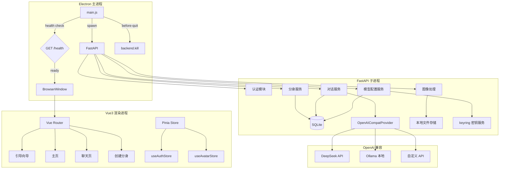
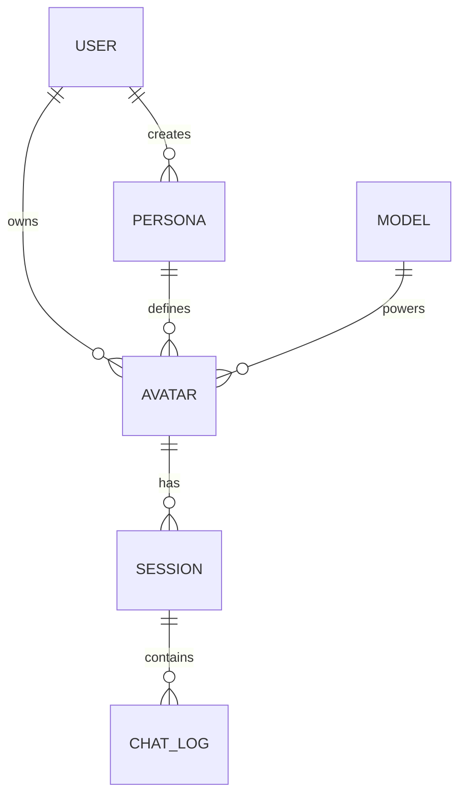
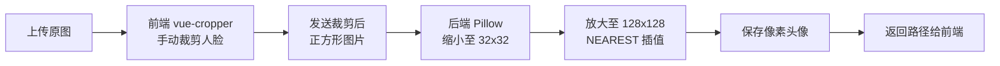
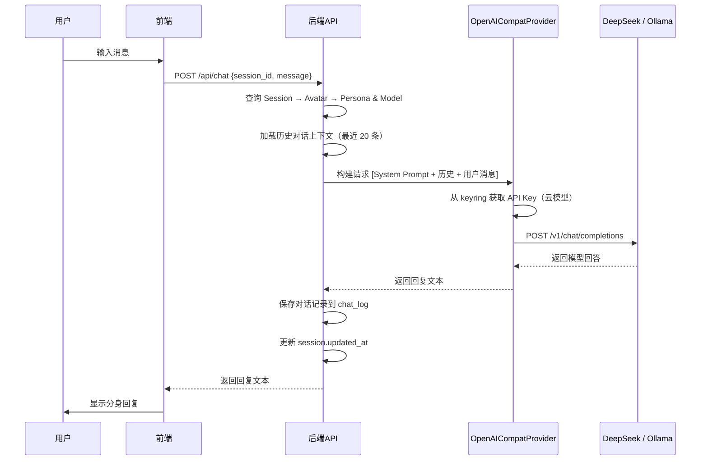
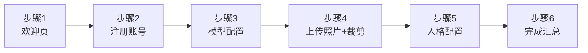

# 📋 MultiYou 第一阶段设计文档 — 基础版（MVP）

> **阶段目标**：实现核心闭环 —— 首次引导 → 上传照片手动裁剪 → 生成像素头像 → 单分身展示 → 多会话对话聊天  
> **交付物**：可运行的桌面应用原型（Windows），包含完整引导流程、用户管理、单分身多会话聊天、云/本地模型可配

---

## 一、阶段概述

第一阶段聚焦于产品最小可行版本（MVP），验证 MultiYou 的核心价值：**让用户通过照片创建像素风数字分身，并与之对话**。此阶段不涉及多分身、技能系统、桌面动画等高级功能，专注于打通端到端流程。

与早期设计不同，本阶段经过深度技术探索后做出了以下关键决策：
- **模型层**：采用 OpenAI 兼容统一接口，支持 DeepSeek（默认云端）、Ollama（本地）及任意 OpenAI 兼容服务
- **图像裁剪**：前端 vue-cropper 手动裁剪取代后端 OpenCV 人脸检测，降低依赖复杂度
- **首次引导**：强制 6 步 Onboarding 向导，确保新用户完成基础配置
- **打包方案**：从第一天起考虑 Electron + Python 嵌入式打包（Windows 优先）
- **会话管理**：支持多会话（新建会话、会话标题、会话列表）

### 核心功能清单

| 功能 | 说明 | 优先级 |
|:---|:---|:---:|
| 首次引导向导 | 6 步 Onboarding：欢迎→注册→模型配→上传裁剪→人格→完成 | P0 |
| 用户注册/登录 | 本地账户系统，JWT 认证 | P0 |
| 上传照片 + 手动裁剪 | 支持 JPG/PNG，前端 vue-cropper 手动选择人脸区域 | P0 |
| 像素化头像生成 | 后端 Pillow 对裁剪后的正方形图像做像素化处理 | P0 |
| 单分身创建与展示 | 创建一个分身并在主页展示 | P0 |
| 多会话聊天 | 与分身对话，支持新建会话、会话列表、会话标题 | P0 |
| 基础人格设定 | 为分身配置简单的 System Prompt | P1 |
| 云+本地模型可配 | 统一 OpenAI 兼容接口，DeepSeek 默认 + Ollama 可选 | P0 |
| API Key 安全存储 | 使用 OS 级 keyring 存储云服务 API Key | P0 |

### 本阶段边界（避免跨阶段混入）

**本阶段只包含：**
- 单分身闭环：引导 → 创建 → 展示 → 多会话聊天
- 云+本地模型统一接入（OpenAI 兼容协议）
- 基础用户与数据持久化能力
- Windows 平台打包

**本阶段不包含：**
- 多分身管理
- 技能系统与工具路由
- 桌面动画/悬浮窗
- 云同步、技能市场、多 Agent 协作
- macOS / Linux 打包（延后）

---

## 二、技术架构

### 总体架构

```
Electron 主进程
    ├── spawn FastAPI 子进程（Python）
    │     ├── GET /health 健康检查（500ms 轮询，最多 20 次）
    │     ├── REST API 服务
    │     ├── SQLite 本地数据库
    │     └── OpenAI 兼容模型调用层
    │           ├── DeepSeek（默认云端）
    │           ├── Ollama（本地可选）
    │           └── 任意 OpenAI 兼容 API
    └── Vue3 渲染进程（BrowserWindow）
          └── http://localhost:8000
```

### 技术选型

| 模块 | 技术 | 说明 |
|:---|:---|:---|
| 前端框架 | Vue 3 + Pinia | 响应式 UI + 状态管理 |
| 桌面壳 | Electron + electron-builder | 桌面打包，extraResources 嵌入 Python |
| 图片裁剪 | vue-cropper@next | 前端手动裁剪人脸区域 |
| HTTP 客户端 | axios | 前端 API 请求 |
| 后端 | FastAPI (Python) | 轻量高性能 REST API |
| ORM | SQLAlchemy (同步模式) | SQLite 无需 async，同步更简单 |
| 数据库 | SQLite | 本地嵌入式，零配置 |
| AI 模型 | OpenAI 兼容统一接口 | DeepSeek（默认）/ Ollama / 自定义 |
| 图像处理 | Pillow | 裁剪后图像像素化 |
| HTTP 客户端(后端) | httpx | 调用 LLM API |
| 认证 | python-jose + passlib[bcrypt] | JWT Token + 密码哈希 |
| 密钥存储 | keyring | OS 级安全存储 API Key |
| Python 嵌入 | python-3.x-embed-amd64 | Windows 嵌入式 Python (~15MB) |

### 架构图



---

## 三、项目目录结构

```
MultiYou/
├── frontend/
│   ├── electron/                    # Electron 主进程
│   │   ├── main.js                  # 入口：spawn backend, health check, BrowserWindow
│   │   └── backend-manager.js       # 后端进程管理（启动/健康检查/杀进程）
│   └── vue-app/                     # Vue3 前端应用
│       ├── src/
│       │   ├── views/
│       │   │   ├── Login.vue            # 登录
│       │   │   ├── Register.vue         # 注册
│       │   │   ├── Home.vue             # 主页（分身展示）
│       │   │   ├── CreateAvatar.vue     # 创建分身（含裁剪上传）
│       │   │   ├── Chat.vue             # 聊天页面（含会话列表侧栏）
│       │   │   └── onboarding/
│       │   │       ├── Welcome.vue          # 步骤1：欢迎页
│       │   │       ├── AccountSetup.vue     # 步骤2：注册账号
│       │   │       ├── ModelConfig.vue      # 步骤3：模型配置
│       │   │       ├── PhotoUpload.vue      # 步骤4：上传照片+裁剪
│       │   │       ├── PersonaSetup.vue     # 步骤5：人格配置
│       │   │       └── Complete.vue         # 步骤6：完成汇总
│       │   ├── components/
│       │   │   ├── ImageCropper.vue     # vue-cropper 封装组件
│       │   │   ├── SessionList.vue      # 会话列表侧栏组件
│       │   │   ├── ChatMessage.vue      # 单条消息组件
│       │   │   └── ModelSelector.vue    # 模型选择下拉组件
│       │   ├── router/
│       │   │   └── index.js             # 路由配置（含引导 guard）
│       │   ├── stores/
│       │   │   ├── auth.js              # useAuthStore（Pinia）
│       │   │   └── avatar.js            # useAvatarStore（Pinia）
│       │   ├── api/
│       │   │   ├── auth.js              # 认证 API
│       │   │   ├── avatar.js            # 分身 API
│       │   │   ├── chat.js              # 对话 API
│       │   │   └── model.js             # 模型配置 API
│       │   └── App.vue
│       ├── package.json
│       └── vite.config.js
│
├── backend/
│   ├── main.py                      # FastAPI 入口 + /health 端点
│   ├── api/
│   │   ├── auth.py                  # 认证接口
│   │   ├── avatar.py                # 分身接口
│   │   ├── chat.py                  # 对话接口
│   │   └── model_config.py          # 模型配置 CRUD 接口
│   ├── services/
│   │   ├── avatar_service.py        # 分身业务逻辑
│   │   ├── image_service.py         # Pillow 像素化处理
│   │   ├── chat_service.py          # 对话业务逻辑
│   │   ├── model_provider.py        # OpenAICompatProvider 统一模型调用
│   │   └── key_service.py           # keyring API Key 存储服务
│   ├── models/
│   │   ├── db_models.py             # SQLAlchemy ORM 模型
│   │   └── schemas.py               # Pydantic 请求/响应模型
│   ├── db/
│   │   ├── database.py              # SQLAlchemy engine + SessionLocal
│   │   └── seed.py                  # 初始数据（默认 DeepSeek 模型配置）
│   └── requirements.txt
│
├── scripts/
│   ├── setup-python-embed.ps1       # 下载并配置 Windows 嵌入式 Python
│   └── build.ps1                    # 打包构建脚本
│
├── assets/
│   └── avatar/                      # 生成的头像存储
│
├── data/                            # SQLite 数据文件
│   └── multiyou.db
│
└── README.md
```

---

## 四、数据库设计

本阶段使用 SQLite + SQLAlchemy（同步模式）。SQLite 不涉及网络 I/O，无需 async。

```sql
-- 用户表
CREATE TABLE user (
    id INTEGER PRIMARY KEY AUTOINCREMENT,
    username TEXT NOT NULL UNIQUE,
    password_hash TEXT NOT NULL,
    onboarding_done INTEGER DEFAULT 0,  -- 是否完成引导向导
    created_at DATETIME DEFAULT CURRENT_TIMESTAMP
);

-- 人格表
CREATE TABLE persona (
    id INTEGER PRIMARY KEY AUTOINCREMENT,
    user_id INTEGER NOT NULL,
    name TEXT NOT NULL,
    system_prompt TEXT NOT NULL,
    description TEXT,
    created_at DATETIME DEFAULT CURRENT_TIMESTAMP,
    FOREIGN KEY (user_id) REFERENCES user(id)
);

-- 模型配置表
CREATE TABLE model (
    id INTEGER PRIMARY KEY AUTOINCREMENT,
    name TEXT NOT NULL,              -- 显示名称，如 "DeepSeek V3"
    model_id TEXT NOT NULL,          -- 模型标识，如 "deepseek-chat"
    provider TEXT NOT NULL,          -- 如 "deepseek", "ollama", "openai"
    endpoint TEXT NOT NULL,          -- 如 "https://api.deepseek.com"
    api_key TEXT,                    -- keyring 引用标识（非明文）
    config_json TEXT,                -- 扩展配置 JSON（temperature 等）
    is_local INTEGER DEFAULT 0,     -- 1=本地模型（Ollama），0=云端
    created_at DATETIME DEFAULT CURRENT_TIMESTAMP
);

-- 分身表
CREATE TABLE avatar (
    id INTEGER PRIMARY KEY AUTOINCREMENT,
    user_id INTEGER NOT NULL,
    persona_id INTEGER NOT NULL,
    model_id INTEGER NOT NULL,
    name TEXT,
    image_path TEXT,                 -- 本地头像文件路径
    created_at DATETIME DEFAULT CURRENT_TIMESTAMP,
    FOREIGN KEY (user_id) REFERENCES user(id),
    FOREIGN KEY (persona_id) REFERENCES persona(id),
    FOREIGN KEY (model_id) REFERENCES model(id)
);

-- 会话表
CREATE TABLE session (
    id INTEGER PRIMARY KEY AUTOINCREMENT,
    avatar_id INTEGER NOT NULL,
    title TEXT DEFAULT '新对话',      -- 会话标题（可手动或自动生成）
    start_time DATETIME DEFAULT CURRENT_TIMESTAMP,
    updated_at DATETIME DEFAULT CURRENT_TIMESTAMP,  -- 最后活跃时间
    FOREIGN KEY (avatar_id) REFERENCES avatar(id)
);

-- 对话日志表
CREATE TABLE chat_log (
    id INTEGER PRIMARY KEY AUTOINCREMENT,
    session_id INTEGER NOT NULL,
    role TEXT NOT NULL CHECK(role IN ('user', 'assistant', 'system')),
    content TEXT NOT NULL,
    timestamp DATETIME DEFAULT CURRENT_TIMESTAMP,
    FOREIGN KEY (session_id) REFERENCES session(id)
);
```

### 初始数据种子（seed）

应用首次启动时自动插入默认模型配置：

```sql
INSERT INTO model (name, model_id, provider, endpoint, is_local) VALUES
('DeepSeek V3', 'deepseek-chat', 'deepseek', 'https://api.deepseek.com', 0);
```

> 用户也可在引导向导中手动添加 Ollama 或其他 OpenAI 兼容模型。

### ER 关系图



---

## 五、后端 API 设计

### 健康检查

| 方法 | 路径 | 说明 |
|:---|:---|:---|
| GET | `/health` | 后端就绪检查，Electron 轮询用 |

**响应**：
```json
{ "status": "ok" }
```

### 认证接口

| 方法 | 路径 | 说明 |
|:---|:---|:---|
| POST | `/api/auth/register` | 用户注册 |
| POST | `/api/auth/login` | 用户登录，返回 JWT Token |

**注册请求**：
```json
{ "username": "alice", "password": "secure123" }
```

**登录响应**：
```json
{ "user_id": 1, "token": "eyJhbGciOi...", "onboarding_done": false }
```

### 引导向导接口

| 方法 | 路径 | 说明 |
|:---|:---|:---|
| POST | `/api/onboarding/setup` | 一次性完成引导向导所有配置 |

**请求体**（multipart/form-data）：
- `model_provider`：模型提供商（"deepseek" / "ollama" / "custom"）
- `model_endpoint`：模型 API 端点
- `api_key`：API Key（云服务必填）
- `file`：用户照片文件
- `crop_data`：裁剪坐标 JSON `{"x": 100, "y": 50, "width": 300, "height": 300}`
- `persona_name`：人格名称
- `persona_prompt`：人格 System Prompt
- `avatar_name`：分身昵称

**响应**：
```json
{
    "avatar_id": 1,
    "message": "引导完成，分身已创建"
}
```

### 模型配置接口

| 方法 | 路径 | 说明 |
|:---|:---|:---|
| GET | `/api/models` | 获取所有已配置模型 |
| POST | `/api/models` | 新增模型配置 |
| PUT | `/api/models/{id}` | 更新模型配置 |
| DELETE | `/api/models/{id}` | 删除模型配置 |
| POST | `/api/models/{id}/test` | 测试模型连通性 |

**新增模型请求**：
```json
{
    "name": "Ollama Llama3",
    "model_id": "llama3",
    "provider": "ollama",
    "endpoint": "http://localhost:11434",
    "is_local": true
}
```

**测试连通性响应**：
```json
{ "success": true, "message": "模型响应正常", "latency_ms": 230 }
```

### 分身接口

| 方法 | 路径 | 说明 |
|:---|:---|:---|
| GET | `/api/avatars` | 获取当前用户所有分身 |
| POST | `/api/avatars` | 创建分身（含图片上传） |
| GET | `/api/avatars/{id}` | 获取分身详情 |

**创建分身请求**（multipart/form-data）：
- `file`：已裁剪的用户照片
- `name`：分身昵称
- `persona_id`：关联人格 ID
- `model_id`：关联模型 ID

**创建分身响应**：
```json
{
    "id": 1,
    "name": "学习分身",
    "image_path": "/assets/avatar/1_pixel.png",
    "persona": { "name": "学习助手", "system_prompt": "..." },
    "model": { "name": "DeepSeek V3", "provider": "deepseek" }
}
```

### 会话接口

| 方法 | 路径 | 说明 |
|:---|:---|:---|
| GET | `/api/avatars/{id}/sessions` | 获取分身的所有会话列表 |
| POST | `/api/sessions` | 新建会话 |
| PUT | `/api/sessions/{id}` | 更新会话标题 |

**新建会话请求**：
```json
{ "avatar_id": 1 }
```

**新建会话响应**：
```json
{ "id": 42, "title": "新对话", "start_time": "2025-01-01T00:00:00" }
```

**会话列表响应**：
```json
[
    { "id": 42, "title": "量子计算讨论", "updated_at": "2025-01-01T12:00:00" },
    { "id": 41, "title": "新对话", "updated_at": "2025-01-01T10:00:00" }
]
```

### 对话接口

| 方法 | 路径 | 说明 |
|:---|:---|:---|
| POST | `/api/chat` | 与分身对话 |
| GET | `/api/sessions/{id}/logs` | 获取会话历史 |

**对话请求**：
```json
{ "session_id": 42, "message": "帮我解释一下量子计算" }
```

**对话响应**：
```json
{
    "reply": "量子计算是利用量子力学原理进行信息处理的计算方式...",
    "session_id": 42
}
```

### 人格接口

| 方法 | 路径 | 说明 |
|:---|:---|:---|
| GET | `/api/personas` | 列出所有人格模板 |
| POST | `/api/personas` | 创建人格 |

> 所有接口（除注册/登录/健康检查外）需携带 `Authorization: Bearer <token>` 请求头。

---

## 六、图像生成流程

本阶段采用 **前端手动裁剪 + 后端 Pillow 像素化** 方案。用户在前端使用 vue-cropper 手动框选人脸区域，后端只负责像素化处理，无需 OpenCV 等重型依赖。

### 处理流程



### 前端裁剪组件（ImageCropper.vue 核心逻辑）

```javascript
// vue-cropper@next 关键配置
const cropperOptions = {
  aspectRatio: 1,         // 强制正方形
  viewMode: 1,            // 限制裁剪框在图片内
  dragMode: 'move',       // 只能移动裁剪框
  autoCropArea: 0.6,      // 默认框选 60% 区域
  guides: true,           // 显示裁剪参考线
}

// 获取裁剪结果（Blob）
function getCroppedBlob() {
  return new Promise(resolve => {
    cropper.getCroppedCanvas({
      width: 512,           // 输出 512x512 正方形
      height: 512,
      imageSmoothingQuality: 'high'
    }).toBlob(resolve, 'image/png')
  })
}
```

### 后端像素化核心代码

```python
from PIL import Image
import io

def pixelate_avatar(image_bytes: bytes, output_path: str, pixel_size: int = 32) -> str:
    """将前端裁剪后的正方形图像进行像素化处理"""
    img = Image.open(io.BytesIO(image_bytes))
    
    # 前端已裁剪为正方形，此处确保尺寸一致
    img = img.resize((512, 512), Image.LANCZOS)
    
    # 缩小再放大，产生像素效果
    img_small = img.resize((pixel_size, pixel_size), Image.NEAREST)
    img_pixel = img_small.resize((128, 128), Image.NEAREST)
    
    img_pixel.save(output_path)
    return output_path
```

### 拼接系统（预留）

本阶段仅做基础像素化处理。预留图层拼接接口，后续阶段将实现：

```
图层顺序：身体底图 → 衣服图层 → 像素化人脸
```

---

## 七、Agent 对话系统

### 对话流程



### Prompt 构建逻辑

```python
def build_messages(persona, history, user_message):
    messages = [
        {"role": "system", "content": persona.system_prompt}
    ]
    # 滑动窗口：加载最近 20 条历史
    for log in history[-20:]:
        messages.append({"role": log.role, "content": log.content})
    messages.append({"role": "user", "content": user_message})
    return messages
```

### 统一模型调用层（OpenAICompatProvider）

所有模型（DeepSeek、Ollama、OpenAI 等）均使用 `/v1/chat/completions` 兼容接口，通过一个统一 Provider 类调用：

```python
import httpx
import keyring

class OpenAICompatProvider:
    """统一 OpenAI 兼容模型调用"""
    
    def __init__(self, model_config):
        self.model_id = model_config.model_id
        self.endpoint = model_config.endpoint.rstrip('/')
        self.is_local = model_config.is_local
        
        # 云端模型从 keyring 获取 API Key
        self.api_key = None
        if not self.is_local and model_config.api_key:
            self.api_key = keyring.get_password("multiyou", model_config.api_key)
    
    def call(self, messages: list) -> str:
        headers = {"Content-Type": "application/json"}
        if self.api_key:
            headers["Authorization"] = f"Bearer {self.api_key}"
        
        with httpx.Client(timeout=60.0) as client:
            resp = client.post(
                f"{self.endpoint}/v1/chat/completions",
                headers=headers,
                json={
                    "model": self.model_id,
                    "messages": messages
                }
            )
            resp.raise_for_status()
            data = resp.json()
            return data["choices"][0]["message"]["content"]
```

### API Key 安全存储

```python
import keyring

def store_api_key(provider: str, api_key: str):
    """将 API Key 存储到 OS 级 keyring"""
    keyring.set_password("multiyou", f"apikey_{provider}", api_key)

def get_api_key(provider: str) -> str:
    """从 keyring 读取 API Key"""
    return keyring.get_password("multiyou", f"apikey_{provider}")
```

> **Windows**: 使用 Windows Credential Manager  
> **macOS**: 使用 Keychain（后续阶段）

---

## 八、前端页面设计

### 页面路由

| 路由 | 页面 | 说明 |
|:---|:---|:---|
| `/onboarding` | Onboarding/*.vue | 首次引导向导（6 步） |
| `/login` | Login.vue | 登录 |
| `/register` | Register.vue | 注册 |
| `/` | Home.vue | 主页，展示分身列表 |
| `/create` | CreateAvatar.vue | 创建新分身（含裁剪） |
| `/chat/:id` | Chat.vue | 与分身对话（含会话侧栏） |

### 路由守卫逻辑

```javascript
router.beforeEach((to, from, next) => {
  const auth = useAuthStore()
  
  // 未登录 → 引导或登录
  if (!auth.token && !['login', 'register', 'onboarding'].includes(to.name)) {
    return next('/login')
  }
  
  // 已登录但未完成引导 → 强制跳转引导
  if (auth.token && !auth.onboardingDone && to.name !== 'onboarding') {
    return next('/onboarding')
  }
  
  next()
})
```

### 引导向导流程（6 步）



**各步骤详情：**

| 步骤 | 组件 | 功能 |
|:---:|:---|:---|
| 1 | Welcome.vue | 产品介绍、核心卖点展示 |
| 2 | AccountSetup.vue | 用户名+密码注册（即时调用注册 API） |
| 3 | ModelConfig.vue | 选择模型提供商（DeepSeek 默认预填），输入 API Key，可测试连通性 |
| 4 | PhotoUpload.vue | 上传照片 → vue-cropper 手动框选人脸 → 预览像素化效果 |
| 5 | PersonaSetup.vue | 输入分身名称、选择/编写人格 System Prompt |
| 6 | Complete.vue | 汇总展示所有配置 → 一键提交 → 调用 `/api/onboarding/setup` |

### 页面线框描述

**引导向导（步骤指示器）**：
```
┌──────────────────────────────────────┐
│  MultiYou 引导向导                    │
│  ● ● ○ ○ ○ ○  步骤 2/6：注册账号     │
├──────────────────────────────────────┤
│                                      │
│  ┌────────────────────────────┐      │
│  │   用户名                    │      │
│  └────────────────────────────┘      │
│  ┌────────────────────────────┐      │
│  │   密码                      │      │
│  └────────────────────────────┘      │
│  ┌────────────────────────────┐      │
│  │   确认密码                  │      │
│  └────────────────────────────┘      │
│                                      │
│         [上一步]    [下一步]          │
└──────────────────────────────────────┘
```

**引导向导 - 步骤3 模型配置**：
```
┌──────────────────────────────────────┐
│  ● ● ● ○ ○ ○  步骤 3/6：模型配置     │
├──────────────────────────────────────┤
│                                      │
│  模型提供商：                         │
│  ┌─────────────────────────┐         │
│  │ ▼ DeepSeek（推荐）       │         │
│  └─────────────────────────┘         │
│                                      │
│  API Key：                           │
│  ┌─────────────────────────┐         │
│  │ sk-***                   │ [测试]  │
│  └─────────────────────────┘         │
│                                      │
│  ✅ 连接成功，延迟 230ms              │
│                                      │
│  💡 也可稍后在设置中添加本地 Ollama    │
│                                      │
│         [上一步]    [下一步]          │
└──────────────────────────────────────┘
```

**引导向导 - 步骤4 照片裁剪**：
```
┌──────────────────────────────────────┐
│  ● ● ● ● ○ ○  步骤 4/6：上传照片     │
├──────────────────────────────────────┤
│  ┌─────────────────┐  ┌──────────┐  │
│  │                  │  │          │  │
│  │   vue-cropper    │  │  像素化  │  │
│  │   裁剪区域       │  │  预览    │  │
│  │   ┌──────┐      │  │  ╔══════╗│  │
│  │   │ 裁剪框│      │  │  ║▓▓▓▓▓▓║│  │
│  │   └──────┘      │  │  ║▓▓▓▓▓▓║│  │
│  │                  │  │  ╚══════╝│  │
│  └─────────────────┘  └──────────┘  │
│                                      │
│  [重新上传]       [上一步] [下一步]   │
└──────────────────────────────────────┘
```

**登录页**：
```
┌──────────────────────────┐
│       MultiYou Logo      │
│                          │
│  ┌────────────────────┐  │
│  │   用户名            │  │
│  └────────────────────┘  │
│  ┌────────────────────┐  │
│  │   密码              │  │
│  └────────────────────┘  │
│  [  登录  ]  [  注册  ]  │
└──────────────────────────┘
```

**主页（分身列表）**：
```
┌──────────────────────────────────┐
│  MultiYou          [+ 创建分身]   │
├──────────────────────────────────┤
│  ┌──────┐  ┌──────┐  ┌──────┐   │
│  │ 头像  │  │ 头像  │  │  +   │   │
│  │ 名称  │  │ 名称  │  │ 新建  │   │
│  │ 人格  │  │ 人格  │  │      │   │
│  └──────┘  └──────┘  └──────┘   │
└──────────────────────────────────┘
```

**聊天页（含会话侧栏）**：
```
┌──────────────────────────────────────────────┐
│  ← 返回         学习分身          ⚙ 设置     │
├────────────┬─────────────────────────────────┤
│ 会话列表    │                                 │
│            │  ┌──────┐                        │
│ [+ 新会话]  │  │像素头像│  分身: 你好！有什么... │
│            │  └──────┘                        │
│ ● 量子计算  │                                 │
│   讨论      │        用户: 帮我解释量子计算     │
│            │                                 │
│ ○ 编程学习  │  ┌──────┐                        │
│            │  │像素头像│  分身: 量子计算是...    │
│ ○ 新对话    │  └──────┘                        │
│            ├─────────────────────────────────┤
│            │  [  输入消息...          ] [发送]  │
└────────────┴─────────────────────────────────┘
```

### Pinia 状态管理

```javascript
// stores/auth.js
export const useAuthStore = defineStore('auth', {
  state: () => ({
    token: null,
    userId: null,
    onboardingDone: false
  }),
  actions: {
    login(token, userId, onboardingDone) { /* ... */ },
    logout() { /* ... */ }
  },
  persist: true  // localStorage 持久化
})

// stores/avatar.js
export const useAvatarStore = defineStore('avatar', {
  state: () => ({
    avatars: [],
    currentAvatar: null,
    sessions: [],
    currentSession: null
  }),
  actions: {
    fetchAvatars() { /* GET /api/avatars */ },
    fetchSessions(avatarId) { /* GET /api/avatars/{id}/sessions */ },
    createSession(avatarId) { /* POST /api/sessions */ }
  }
})
```

---

## 九、安全与隐私

- **密码安全**：使用 bcrypt（passlib）对密码进行哈希存储，不存储明文密码
- **JWT 认证**：所有 API 接口通过 JWT Token 鉴权，Token 有效期 24 小时
- **API Key 安全**：云模型 API Key 通过 `keyring` 存储在 OS 级凭据管理器中（Windows Credential Manager），数据库仅存储引用标识，不存储明文 Key
- **本地优先**：所有数据（照片、对话、数据库）存储在本地，不上传云端
- **文件上传限制**：限制上传文件类型（JPG/PNG）和大小（≤5MB），防止恶意文件
- **原图清理**：头像像素化完成后删除用户上传的原始照片，仅保留像素化结果
- **进程生命周期**：Electron `before-quit` 事件中执行 `backend.kill()`，避免 Python 僵尸进程占用端口

---

## 十、Electron + Python 嵌入式打包方案

### 打包策略

从第一天起采用 Electron + Python 嵌入式方案，避免后期集成困难。

```
dist/
├── MultiYou.exe                    # Electron 主程序
├── resources/
│   ├── app.asar                    # Vue3 前端打包
│   └── python-backend/             # extraResources
│       ├── python-embed/           # Windows 嵌入式 Python (~15MB)
│       │   ├── python.exe
│       │   ├── python311.dll
│       │   └── Lib/site-packages/  # pip 安装的依赖
│       └── backend/                # FastAPI 后端代码
│           ├── main.py
│           ├── api/
│           ├── services/
│           └── ...
```

### 关键实现

**backend-manager.js（Electron 主进程）**：

```javascript
const { spawn } = require('child_process')
const path = require('path')
const http = require('http')

class BackendManager {
  constructor() {
    this.process = null
    this.port = 8000
  }

  getPythonPath() {
    if (app.isPackaged) {
      // 生产环境：使用 extraResources 中的嵌入式 Python
      return path.join(process.resourcesPath, 'python-backend', 'python-embed', 'python.exe')
    } else {
      // 开发环境：使用系统 Python / venv
      return 'python'
    }
  }

  getBackendPath() {
    if (app.isPackaged) {
      return path.join(process.resourcesPath, 'python-backend', 'backend', 'main.py')
    } else {
      return path.join(__dirname, '..', '..', 'backend', 'main.py')
    }
  }

  start() {
    const pythonPath = this.getPythonPath()
    const backendPath = this.getBackendPath()
    this.process = spawn(pythonPath, ['-m', 'uvicorn', 'main:app', '--port', this.port], {
      cwd: path.dirname(backendPath),
      stdio: ['pipe', 'pipe', 'pipe']
    })
  }

  async waitForReady(maxAttempts = 20, interval = 500) {
    for (let i = 0; i < maxAttempts; i++) {
      try {
        await this._healthCheck()
        return true
      } catch {
        await new Promise(r => setTimeout(r, interval))
      }
    }
    throw new Error('Backend failed to start')
  }

  _healthCheck() {
    return new Promise((resolve, reject) => {
      http.get(`http://localhost:${this.port}/health`, res => {
        res.statusCode === 200 ? resolve() : reject()
      }).on('error', reject)
    })
  }

  stop() {
    if (this.process) {
      this.process.kill()
      this.process = null
    }
  }
}
```

**electron-builder 配置**：

```json
{
  "build": {
    "extraResources": [
      {
        "from": "python-backend/",
        "to": "python-backend/",
        "filter": ["**/*", "!__pycache__/**"]
      }
    ],
    "win": {
      "target": "nsis",
      "icon": "assets/icon.ico"
    }
  }
}
```

### 开发/生产路径切换

```javascript
// app.isPackaged 判断环境
const isDev = !app.isPackaged
const BACKEND_URL = isDev ? 'http://localhost:8000' : 'http://localhost:8000'
// URL 相同，但 Python 路径不同（dev 用系统 Python，prod 用嵌入式）
```

---

## 十一、开发任务拆解

> ⚠️ **任务 #1 为打包原型验证，必须最先执行**——这是最高风险项，如果 Electron + Python 嵌入式方案不通，后续所有工作都需要调整。

| # | 任务 | 模块 | 依赖 | 风险 |
|:---:|:---|:---:|:---:|:---:|
| 1 | **打包原型验证**：Electron spawn 嵌入式 Python + 健康检查 + 进程生命周期 | 工程 | - | 🔴 高 |
| 2 | 搭建 FastAPI 项目骨架 + SQLAlchemy + SQLite + /health 端点 | 后端 | 1 | - |
| 3 | 实现用户注册/登录 API（JWT + bcrypt） | 后端 | 2 | - |
| 4 | 实现 keyring API Key 存储服务 | 后端 | 2 | 🟡 中 |
| 5 | 实现统一模型调用层 OpenAICompatProvider（DeepSeek + Ollama） | 后端 | 2, 4 | - |
| 6 | 实现模型配置 CRUD API + 连通性测试 | 后端 | 5 | - |
| 7 | 实现 Pillow 像素化图像处理服务 | 后端 | 2 | - |
| 8 | 实现分身 CRUD API | 后端 | 3, 7 | - |
| 9 | 实现人格模板 CRUD API | 后端 | 3 | - |
| 10 | 实现会话管理 API（新建/列表/标题） | 后端 | 8 | - |
| 11 | 实现对话 API（含上下文管理、滑动窗口） | 后端 | 5, 9, 10 | - |
| 12 | 搭建 Vue3 + Electron + Vite + Pinia 项目骨架 | 前端 | 1 | - |
| 13 | 实现登录/注册页面 | 前端 | 12 | - |
| 14 | 实现引导向导 6 步流程（含 vue-cropper 裁剪） | 前端 | 12, 6, 7 | 🟡 中 |
| 15 | 实现主页分身列表展示 | 前端 | 12, 8 | - |
| 16 | 实现创建分身页面（含裁剪上传） | 前端 | 12, 8 | - |
| 17 | 实现聊天页面（含会话侧栏、新建会话） | 前端 | 12, 11 | - |
| 18 | 联调测试与 Bug 修复 | 全栈 | all | - |
| 19 | Windows 打包构建与验证 | 工程 | all | 🟡 中 |

---

## 十二、风险评估

| 风险项 | 等级 | 说明 | 缓解措施 |
|:---|:---:|:---|:---|
| Electron + Python 嵌入式打包 | 🔴 高 | 进程管理、路径切换、资源体积均是未知数 | 任务 #1 最先验证，失败则考虑备选方案（pyinstaller / 系统 Python） |
| vue-cropper 集成 | 🟡 中 | @next 版本可能有 API 兼容问题 | 提前验证 Vue3 兼容性；备选方案：cropperjs 直接使用 |
| keyring 跨平台 | 🟡 中 | Windows 上一般正常，嵌入式 Python 可能缺少依赖 | 打包原型验证时一并测试；备选方案：加密本地文件 |
| DeepSeek API 稳定性 | 🟢 低 | 云服务可能偶尔不可用 | 用户可配置多个模型，随时切换 |

---

## 十三、验收标准

- [ ] 首次启动弹出引导向导，6 步流程可走通
- [ ] 用户可以注册账号并登录
- [ ] 可配置 DeepSeek 云模型（API Key 安全存储在 keyring）
- [ ] 上传照片后，前端手动裁剪人脸区域，后端生成像素风头像
- [ ] 可以创建一个分身，配置名称和人格描述
- [ ] 可以与分身进行多轮对话，对话内容持久化
- [ ] 支持多会话：新建会话、会话列表展示、切换会话
- [ ] 分身基于配置的模型（DeepSeek / Ollama）回答问题
- [ ] 应用可打包为 Windows 可执行文件（Electron + Python 嵌入式）
- [ ] 关闭应用时 Python 后端进程正确退出，不残留
