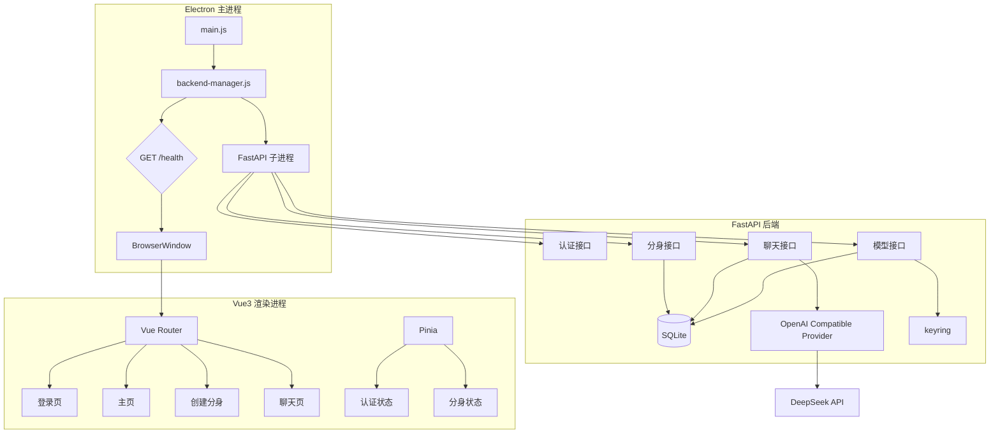
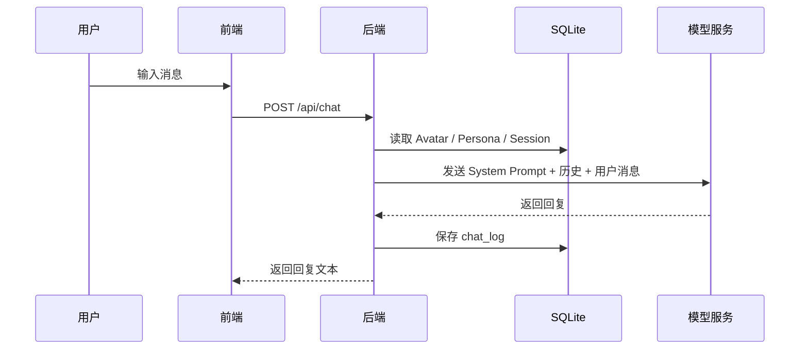

# 📋 MultiYou 第一阶段设计文档 — 基础骨架版

> **阶段目标**：搭建 MultiYou 的基础技术骨架，完成 Electron + Vue3 + FastAPI + SQLite 的联通，验证本地运行、基础对话链路与 Windows `.exe` 打包能力。  
> **交付物**：一个可以安装运行的 Windows 桌面应用骨架，支持注册登录、基础分身创建、基础聊天，并能完整打包为 `.exe`。

---

## 一、阶段定位

第一阶段不追求产品功能完整，而是优先解决两个高风险问题：

- 技术栈能不能稳定跑通
- 项目能不能顺利打包成可交付的 Windows 桌面程序

这一阶段的目标是先把项目的“骨架”立起来，确保前端、桌面壳、后端、数据库、模型调用、进程管理都能协同工作。图像上传、像素人生成、多分身、技能系统、动画表现都暂不纳入本阶段。

### 核心成果

| 能力 | 说明 | 优先级 |
|:---|:---|:---:|
| Electron + FastAPI 联调 | Electron 主进程启动和管理 Python 后端 | P0 |
| Vue3 前端骨架 | 登录、主页、创建分身、聊天页面 | P0 |
| 本地用户系统 | 注册、登录、JWT 鉴权 | P0 |
| 基础分身创建 | 输入名称、人格描述，使用默认占位头像 | P0 |
| 基础聊天能力 | 使用默认模型进行多轮对话 | P0 |
| 模型配置 | 支持 DeepSeek 默认接入，预留兼容 OpenAI 接口 | P0 |
| Windows 打包 | 可以生成可安装的 `.exe` 桌面程序 | P0 |

### 本阶段边界

**本阶段只包含：**

- 工程骨架搭建
- 基础认证与本地数据持久化
- 默认占位头像的单分身创建
- 基础聊天链路
- Windows 打包能力

**本阶段不包含：**

- 照片上传、裁剪、像素化生成
- Onboarding 引导向导
- 多分身管理
- 技能系统与工具调用
- 动画、状态机、悬浮窗
- 云同步、技能市场、多 Agent 协作

---

## 二、总体架构

### 架构目标

第一阶段重点验证以下链路：

1. Electron 能启动 Python 后端并完成健康检查
2. Vue3 前端能稳定请求 FastAPI API
3. SQLite 能完成本地数据存储
4. 模型调用链路可工作
5. 整个应用可被打包后独立运行

### 架构图



### 技术选型

| 模块 | 技术 | 说明 |
|:---|:---|:---|
| 桌面端 | Electron | 桌面壳、进程管理、打包 |
| 前端 | Vue 3 + Pinia + Vue Router | 页面与状态管理 |
| 后端 | FastAPI | 本地 REST API |
| 数据库 | SQLite | 本地嵌入式存储 |
| ORM | SQLAlchemy | 数据访问 |
| 模型调用 | OpenAI 兼容协议 | 统一对接 DeepSeek/后续其他模型 |
| 密钥存储 | keyring | API Key 不明文落库 |
| 打包 | electron-builder + Python Embed | Windows 安装包 |

---

## 三、项目结构

```text
MultiYou/
├── frontend/
│   ├── electron/
│   │   ├── main.js
│   │   └── backend-manager.js
│   └── vue-app/
│       ├── src/
│       │   ├── api/
│       │   ├── components/
│       │   ├── router/
│       │   ├── stores/
│       │   └── views/
│       │       ├── Login.vue
│       │       ├── Register.vue
│       │       ├── Home.vue
│       │       ├── CreateAvatar.vue
│       │       └── Chat.vue
│       ├── package.json
│       └── vite.config.js
├── backend/
│   ├── api/
│   ├── db/
│   ├── models/
│   ├── services/
│   ├── config.py
│   ├── main.py
│   └── requirements.txt
├── assets/
│   └── avatar/
│       └── default.png
├── scripts/
│   ├── setup-python-embed.ps1
│   └── build.ps1
└── README.md
```

---

## 四、数据模型

第一阶段采用最小可用数据模型。

```sql
CREATE TABLE user (
    id INTEGER PRIMARY KEY AUTOINCREMENT,
    username TEXT NOT NULL UNIQUE,
    password_hash TEXT NOT NULL,
    created_at DATETIME DEFAULT CURRENT_TIMESTAMP
);

CREATE TABLE persona (
    id INTEGER PRIMARY KEY AUTOINCREMENT,
    user_id INTEGER NOT NULL,
    name TEXT NOT NULL,
    system_prompt TEXT NOT NULL,
    description TEXT,
    created_at DATETIME DEFAULT CURRENT_TIMESTAMP,
    FOREIGN KEY (user_id) REFERENCES user(id)
);

CREATE TABLE model (
    id INTEGER PRIMARY KEY AUTOINCREMENT,
    name TEXT NOT NULL,
    model_id TEXT NOT NULL,
    provider TEXT NOT NULL,
    endpoint TEXT NOT NULL,
    api_key_ref TEXT,
    is_local INTEGER DEFAULT 0,
    created_at DATETIME DEFAULT CURRENT_TIMESTAMP
);

CREATE TABLE avatar (
    id INTEGER PRIMARY KEY AUTOINCREMENT,
    user_id INTEGER NOT NULL,
    persona_id INTEGER NOT NULL,
    model_id INTEGER NOT NULL,
    name TEXT NOT NULL,
    image_path TEXT NOT NULL,
    created_at DATETIME DEFAULT CURRENT_TIMESTAMP,
    FOREIGN KEY (user_id) REFERENCES user(id),
    FOREIGN KEY (persona_id) REFERENCES persona(id),
    FOREIGN KEY (model_id) REFERENCES model(id)
);

CREATE TABLE session (
    id INTEGER PRIMARY KEY AUTOINCREMENT,
    avatar_id INTEGER NOT NULL,
    title TEXT DEFAULT '新对话',
    updated_at DATETIME DEFAULT CURRENT_TIMESTAMP,
    FOREIGN KEY (avatar_id) REFERENCES avatar(id)
);

CREATE TABLE chat_log (
    id INTEGER PRIMARY KEY AUTOINCREMENT,
    session_id INTEGER NOT NULL,
    role TEXT NOT NULL,
    content TEXT NOT NULL,
    timestamp DATETIME DEFAULT CURRENT_TIMESTAMP,
    FOREIGN KEY (session_id) REFERENCES session(id)
);
```

### 默认种子数据

```sql
INSERT INTO model (name, model_id, provider, endpoint, is_local)
VALUES ('DeepSeek V3', 'deepseek-chat', 'deepseek', 'https://api.deepseek.com', 0);
```

---

## 五、后端 API 范围

### 健康检查

| 方法 | 路径 | 说明 |
|:---|:---|:---|
| GET | `/health` | Electron 轮询后端是否就绪 |

### 认证接口

| 方法 | 路径 | 说明 |
|:---|:---|:---|
| POST | `/api/auth/register` | 用户注册 |
| POST | `/api/auth/login` | 用户登录 |

### 模型接口

| 方法 | 路径 | 说明 |
|:---|:---|:---|
| GET | `/api/models` | 获取模型列表 |
| POST | `/api/models` | 添加模型配置 |
| POST | `/api/models/{id}/test` | 测试连通性 |

### 分身接口

| 方法 | 路径 | 说明 |
|:---|:---|:---|
| GET | `/api/avatars` | 获取用户分身列表 |
| POST | `/api/avatars` | 创建分身 |
| GET | `/api/avatars/{id}` | 获取分身详情 |

### 聊天接口

| 方法 | 路径 | 说明 |
|:---|:---|:---|
| POST | `/api/chat` | 发送消息 |
| GET | `/api/sessions/{id}/logs` | 获取会话历史 |

---

## 六、默认分身策略

第一阶段不做图像上传和处理，统一使用默认占位头像。

- 所有新创建分身默认绑定 `assets/avatar/default.png`
- 分身差异仅体现在名称、人格描述、模型配置
- 上传照片、裁剪、像素化生成统一延后到第二阶段

这可以显著降低打包和联调风险，让阶段一专注于工程稳定性。

---

## 七、对话链路

### 基础公式

**分身 = Persona + Model**

### 对话流程



### Prompt 组装原则

- 读取 persona.system_prompt 作为系统提示词
- 加载最近若干轮对话作为上下文
- 使用统一 OpenAI 兼容接口调用模型

---

## 八、前端页面范围

### 页面列表

| 页面 | 说明 |
|:---|:---|
| 登录页 | 用户登录 |
| 注册页 | 用户注册 |
| 主页 | 查看已有分身、进入聊天、创建分身 |
| 创建分身页 | 填写分身名称、人格、选择模型 |
| 聊天页 | 显示消息记录与输入框 |

### 设计原则

- 页面数量少，链路清晰
- 以可联调为优先，不做复杂视觉表现
- 所有页面围绕“能完成操作”设计，而非追求最终产品观感

---

## 九、打包方案

### 打包目标

第一阶段必须完成 Windows 可执行安装包验证。

### 打包策略

- Electron 负责桌面应用和前端分发
- Python Embed 作为后端运行时嵌入 `resources`
- 应用启动后由 Electron 主进程拉起 FastAPI
- 通过 `/health` 轮询确认后端就绪后再打开窗口

### 关键风险

- 嵌入式 Python 的依赖完整性
- 路径切换（开发环境 / 打包环境）
- 退出时后端进程清理

---

## 十、开发任务拆解

| # | 任务 | 模块 | 依赖 |
|:---:|:---|:---:|:---:|
| 1 | 验证 Electron 启动 Python 后端 | 工程 | - |
| 2 | 搭建 FastAPI + SQLite + SQLAlchemy 骨架 | 后端 | 1 |
| 3 | 实现 `/health`、认证、模型、分身、聊天基础接口 | 后端 | 2 |
| 4 | 接入 keyring 进行 API Key 存储 | 后端 | 2 |
| 5 | 搭建 Vue3 + Pinia + Router 前端骨架 | 前端 | 1 |
| 6 | 实现登录、主页、创建分身、聊天页面 | 前端 | 5 |
| 7 | 完成前后端联调 | 全栈 | 3, 6 |
| 8 | 实现 `.exe` 打包与安装验证 | 工程 | 7 |

---

## 十一、验收标准

- [ ] 应用可正常启动，Electron 能拉起 FastAPI 后端
- [ ] 用户可以注册并登录
- [ ] 可以创建至少一个基础分身
- [ ] 可以与分身完成多轮聊天
- [ ] 聊天记录可以持久化保存
- [ ] DeepSeek 默认模型可以正常调用
- [ ] API Key 不以明文形式存储在数据库中
- [ ] 应用可打包为 Windows `.exe` 并在无开发环境机器上运行
