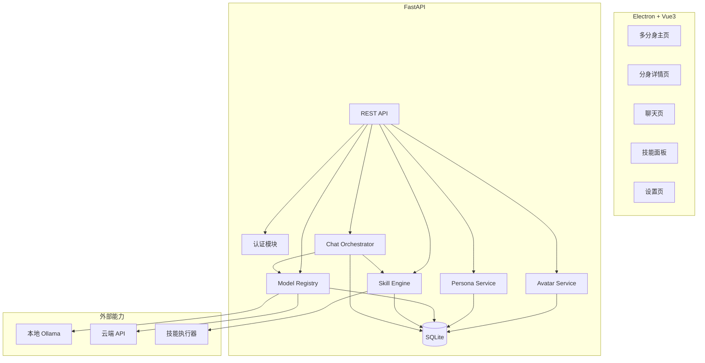
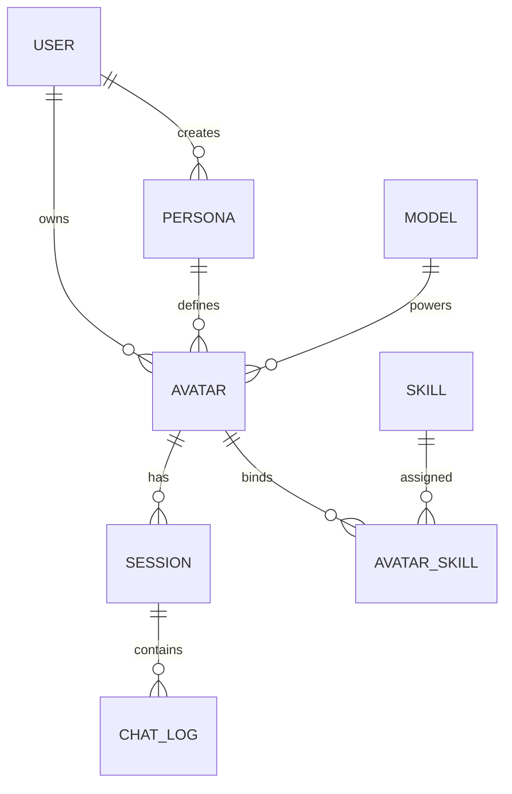
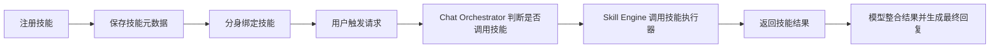
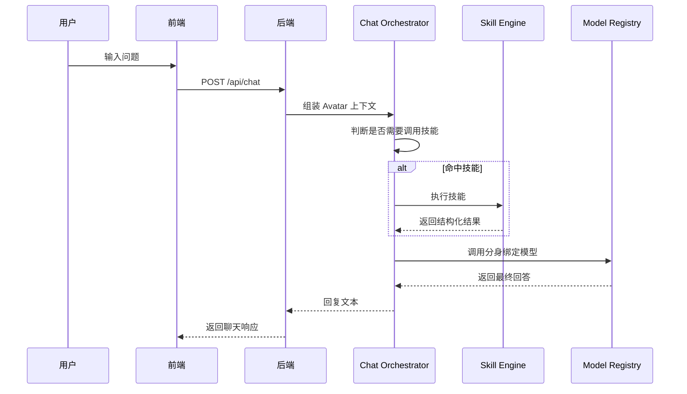
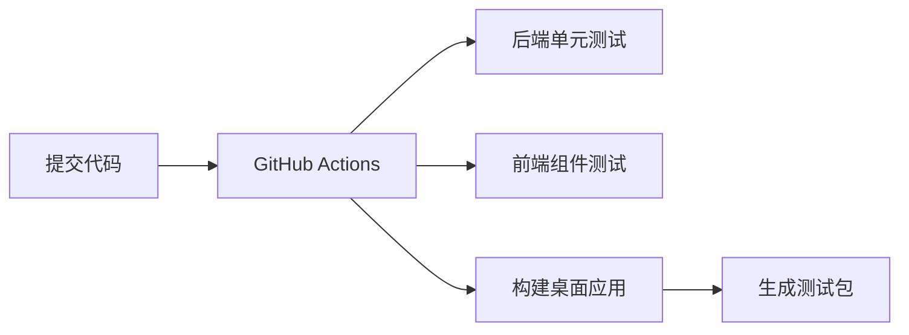

# 📋 MultiYou 第二阶段设计文档 — 进阶版

> **阶段目标**：在 MVP 基础上扩展为可用的多分身系统，支持多模型配置、技能系统雏形与更完整的前后端管理能力。  
> **交付物**：支持多个分身并行管理、模型切换、基础技能调用的桌面应用版本。

---

## 一、阶段概述

第二阶段的重点是从“一个可用的分身原型”升级为“一个真正具备多角色协作雏形的分身系统”。在本阶段，系统开始具备以下产品特征：

- 一个用户可以创建多个分身
- 每个分身可绑定独立人格与模型
- 支持为分身挂载技能
- 增加更完整的管理界面与数据结构
- 为后续动画、协作和市场扩展打基础

### 核心功能清单

| 功能 | 说明 | 优先级 |
|:---|:---|:---:|
| 多分身管理 | 创建、查看、编辑、删除多个分身 | P0 |
| 多模型切换 | 一个分身绑定一个模型，可切换本地/云端模型 | P0 |
| 技能系统基础版 | 支持技能注册、绑定、调用 | P0 |
| 人格模板管理增强 | 人格模板可复用、编辑、删除 | P1 |
| 分身详情页 | 展示人格、模型、技能信息 | P1 |
| 聊天行为路由 | 对用户请求进行简单意图路由到技能 | P1 |
| 基础 CI/CD | 自动测试和打包流程 | P1 |

### 本阶段边界（避免跨阶段混入）

**本阶段只包含：**
- 多分身管理
- 多模型配置与切换
- 技能系统基础版（注册/绑定/调用）
- 聊天编排与基础自动化测试

**本阶段不包含：**
- 分身动画与状态机表现
- 桌面悬浮窗与沉浸式体验优化
- 云同步、技能市场、跨端平台化能力
- 多 Agent 自动协作与工作流编排

---

## 二、架构升级设计

### 架构目标

第二阶段在第一阶段架构上，引入三个关键模块：

- **Model Registry**：统一管理本地与云端模型
- **Skill Engine**：统一注册、绑定与调用技能
- **Avatar Orchestrator**：负责分身上下文组装和执行链路编排

### 架构图



---

## 三、数据模型升级

第二阶段引入技能绑定关系和更完整的模型配置。

### 新增 / 扩展表结构

```sql
-- 模型表增强
CREATE TABLE model (
    id INTEGER PRIMARY KEY AUTOINCREMENT,
    name TEXT NOT NULL,
    provider TEXT NOT NULL,         -- ollama/openai/deepseek
    endpoint TEXT,
    api_key TEXT,
    config_json TEXT,               -- temperature/max_tokens 等
    is_local INTEGER DEFAULT 1,
    created_at DATETIME DEFAULT CURRENT_TIMESTAMP
);

-- 技能表
CREATE TABLE skill (
    id INTEGER PRIMARY KEY AUTOINCREMENT,
    name TEXT NOT NULL UNIQUE,
    description TEXT,
    endpoint TEXT,
    schema_json TEXT,
    enabled INTEGER DEFAULT 1,
    created_at DATETIME DEFAULT CURRENT_TIMESTAMP
);

-- 分身与技能绑定表
CREATE TABLE avatar_skill (
    id INTEGER PRIMARY KEY AUTOINCREMENT,
    avatar_id INTEGER NOT NULL,
    skill_id INTEGER NOT NULL,
    priority INTEGER DEFAULT 0,
    created_at DATETIME DEFAULT CURRENT_TIMESTAMP,
    FOREIGN KEY (avatar_id) REFERENCES avatar(id),
    FOREIGN KEY (skill_id) REFERENCES skill(id)
);
```

### 更新后的实体关系



### 设计原则

- `model` 表允许同时保存本地和云端模型配置
- `skill` 表只描述技能元信息，不直接写业务逻辑
- `avatar_skill` 支持优先级排序，为后续技能调度做准备

---

## 四、Skill 系统设计

### 目标

让分身具备可扩展的能力，不仅依赖大模型纯文本回答，还能调用外部执行模块处理任务。

### Skill 元数据定义

```json
{
  "name": "TextSummarizer",
  "description": "对输入文本进行摘要",
  "endpoint": "/skills/summarize",
  "schema": {
    "type": "object",
    "properties": {
      "text": { "type": "string" }
    },
    "required": ["text"]
  }
}
```

### Skill 生命周期



### 技能调用策略

本阶段采用轻量策略，不做复杂工具调用协议：

1. 后端根据关键词或规则匹配用户意图
2. 若命中某个技能，则将输入交给技能执行器
3. 技能返回结构化结果
4. 结果作为上下文注入模型，生成最终自然语言回复

### 初始技能建议

| 技能名 | 功能 | 输入 | 输出 |
|:---|:---|:---|:---|
| Summarize | 文本摘要 | 长文本 | 摘要文本 |
| WebSearch | 联网搜索 | 查询词 | 搜索结果摘要 |
| CodeGen | 代码生成 | 需求描述 | 代码片段 |
| FileRead | 读取文本文件 | 文件路径 | 文件内容 |

---

## 五、多模型接入设计

### 目标

支持不同分身绑定不同模型，为后续“人格 + 模型差异化”提供技术基础。

### 模型提供方抽象

```python
class BaseModelProvider:
    async def chat(self, model_name: str, messages: list, config: dict) -> str:
        raise NotImplementedError
```

### Provider 实现

- `OllamaProvider`：本地模型
- `OpenAIProvider`：OpenAI 接口
- `DeepSeekProvider`：兼容 OpenAI 格式的远程接口

### 模型调用统一入口

```python
class ModelRegistry:
    def __init__(self):
        self.providers = {
            "ollama": OllamaProvider(),
            "openai": OpenAIProvider(),
            "deepseek": DeepSeekProvider(),
        }

    async def chat(self, model_record, messages):
        provider = self.providers[model_record.provider]
        return await provider.chat(model_record.name, messages, model_record.config)
```

### 模型配置示例

```json
{
  "name": "deepseek-chat",
  "provider": "deepseek",
  "endpoint": "https://api.deepseek.com/v1",
  "api_key": "sk-xxx",
  "config_json": {
    "temperature": 0.7,
    "max_tokens": 2048
  },
  "is_local": 0
}
```

---

## 六、分身执行链路设计

### Avatar 执行公式

第二阶段正式落地 README 中提出的核心公式：

**分身 = Persona + Model + Skills**

### 对话执行链路



### Orchestrator 伪代码

```python
async def handle_chat(avatar, message, session_id):
    persona = get_persona(avatar.persona_id)
    model = get_model(avatar.model_id)
    skills = get_avatar_skills(avatar.id)
    history = get_session_history(session_id)

    skill_result = None
    matched_skill = match_skill(message, skills)
    if matched_skill:
        skill_result = await execute_skill(matched_skill, message)

    messages = build_messages(
        persona=persona,
        history=history,
        user_message=message,
        tool_result=skill_result,
    )

    reply = await model_registry.chat(model, messages)
    save_logs(session_id, message, reply)
    return reply
```

---

## 七、前端页面升级

### 新增页面与能力

| 页面 | 说明 |
|:---|:---|
| 主页 | 多个分身卡片，支持搜索和筛选 |
| 分身详情页 | 查看分身头像、人格、模型、技能 |
| 技能管理页 | 展示技能列表，支持绑定/解绑 |
| 模型管理页 | 新增/编辑模型配置 |
| 人格管理页 | 创建与复用人格模板 |

### 分身详情页布局

```
┌─────────────────────────────────────┐
│ ← 返回        学习分身         编辑   │
├─────────────────────────────────────┤
│  [像素头像]                         │
│  名称：学习分身                     │
│  人格：耐心讲解型                   │
│  模型：deepseek-chat                │
│  技能：Summarize / WebSearch        │
├─────────────────────────────────────┤
│  [进入聊天] [绑定技能] [切换模型]   │
└─────────────────────────────────────┘
```

### 多分身主页布局

```
┌──────────────────────────────────────────────┐
│ MultiYou        搜索框         [+ 创建分身]  │
├──────────────────────────────────────────────┤
│ [学习分身] [工作分身] [程序分身] [数据分身]  │
│ [头像+名称] [头像+名称] [头像+名称] [头像+名称] │
└──────────────────────────────────────────────┘
```

### UX 原则

- 多分身状态切换应尽量轻量，减少跳转成本
- 技能与模型信息在详情页清晰可见
- 聊天页不承载复杂配置，配置操作放在详情/设置页

---

## 八、后端 API 扩展

### 模型管理接口

| 方法 | 路径 | 说明 |
|:---|:---|:---|
| GET | `/api/models` | 获取模型列表 |
| POST | `/api/models` | 新增模型配置 |
| PUT | `/api/models/{id}` | 修改模型配置 |
| DELETE | `/api/models/{id}` | 删除模型配置 |

### 技能管理接口

| 方法 | 路径 | 说明 |
|:---|:---|:---|
| GET | `/api/skills` | 获取所有技能 |
| POST | `/api/skills` | 注册技能 |
| POST | `/api/avatars/{id}/skills` | 为分身绑定技能 |
| DELETE | `/api/avatars/{id}/skills/{skillId}` | 解绑技能 |

### 分身管理接口扩展

| 方法 | 路径 | 说明 |
|:---|:---|:---|
| PUT | `/api/avatars/{id}` | 更新分身信息 |
| DELETE | `/api/avatars/{id}` | 删除分身 |

### 示例：绑定技能

**请求**：
```json
{ "skill_id": 2, "priority": 10 }
```

**响应**：
```json
{
  "avatar_id": 1,
  "skills": [
    { "id": 2, "name": "WebSearch", "priority": 10 }
  ]
}
```

---

## 九、安全与隔离设计

第二阶段引入技能后，安全边界需要加强。

### 新增安全要求

- 技能调用必须通过统一 Skill Engine，不允许前端直接执行脚本
- 技能配置中需声明输入 schema，做参数校验
- 云端模型 API Key 单独加密存储
- 技能执行器需要设置超时和异常捕获
- 文件读取类技能限制访问路径白名单

### 技能执行安全策略

| 风险 | 防护措施 |
|:---|:---|
| 任意命令执行 | 本阶段不开放系统命令技能 |
| 越权文件访问 | 限制根目录白名单 |
| 外部接口阻塞 | 设置超时和熔断 |
| 恶意输入 | schema 校验 + 长度限制 |

---

## 十、测试与 CI/CD

### 测试范围

- 多分身 CRUD 正常工作
- 不同分身绑定不同模型后，对话调用正确
- 技能绑定后可被正确触发
- 技能失败时，系统可降级为普通模型回答
- 删除分身不会破坏历史会话数据一致性

### 自动化流程



### 推荐测试层级

| 层级 | 工具 | 内容 |
|:---|:---|:---|
| 后端单元测试 | Pytest | Service/Orchestrator/SkillEngine |
| API 测试 | FastAPI TestClient | REST 接口 |
| 前端组件测试 | Vitest | Vue 组件 |
| E2E 测试 | Playwright | 主要用户流程 |

---

## 十一、开发任务拆解

| # | 任务 | 模块 | 依赖 |
|:---:|:---|:---:|:---:|
| 1 | 设计并实现技能表与绑定表 | 后端 | 阶段一 |
| 2 | 实现 Skill Engine 注册与调用机制 | 后端 | 1 |
| 3 | 实现多模型配置与统一调用层 | 后端 | 阶段一 |
| 4 | 实现 Chat Orchestrator | 后端 | 2, 3 |
| 5 | 扩展分身 CRUD，支持编辑/删除 | 后端 | 阶段一 |
| 6 | 实现技能管理 API | 后端 | 1, 2 |
| 7 | 实现模型管理 API | 后端 | 3 |
| 8 | 前端增加分身详情页 | 前端 | 阶段一 |
| 9 | 前端增加模型管理与技能绑定页面 | 前端 | 6, 7 |
| 10 | 前端主页支持多分身展示 | 前端 | 5 |
| 11 | 增加自动化测试与 GitHub Actions | 全栈 | all |
| 12 | 集成联调与稳定性修复 | 全栈 | all |

---

## 十二、验收标准

- [ ] 一个用户可以创建多个分身
- [ ] 每个分身可以绑定不同人格和模型
- [ ] 可以在 UI 中查看并管理技能绑定关系
- [ ] 用户发起请求时，系统可根据规则触发技能
- [ ] 技能结果可以注入模型生成更完整答案
- [ ] 本地模型与云端模型均可正常调用
- [ ] 基础 CI/CD 流程可自动完成测试与构建
