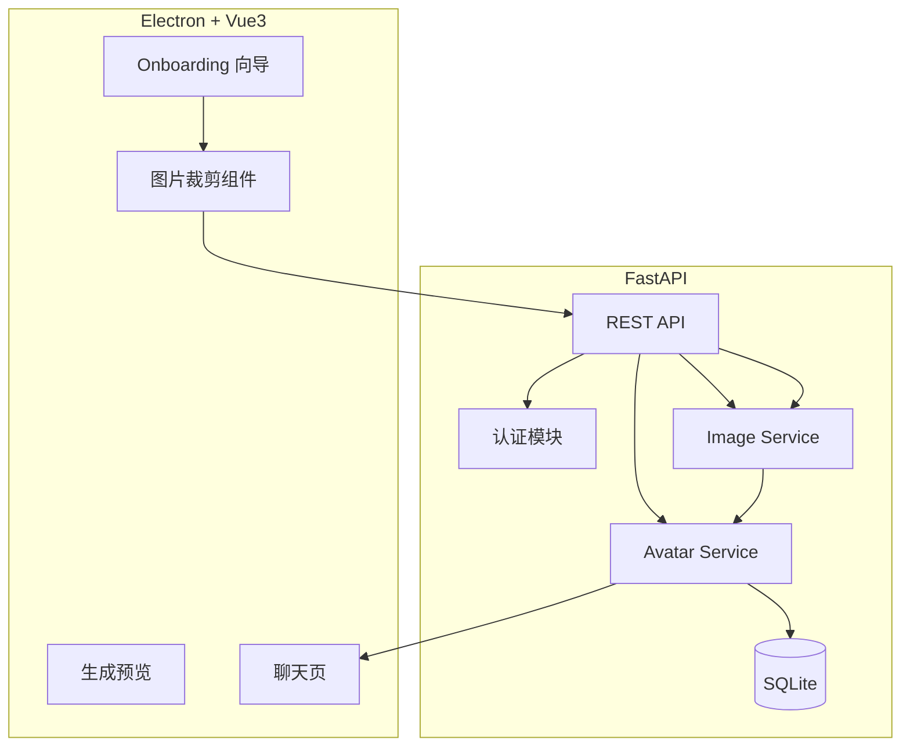
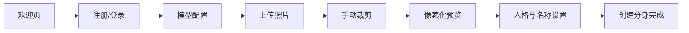
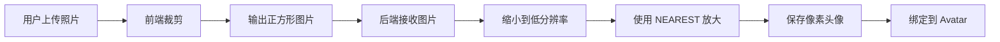

# 📋 MultiYou 第二阶段设计文档 — 完整像素分身生成版

> **阶段目标**：在第一阶段工程骨架稳定运行的基础上，完成“用户照片 → 裁剪 → 像素化 → 分身生成”的完整闭环，并补齐首次使用引导流程。  
> **交付物**：用户可以通过引导流程上传照片，生成可用的像素分身，并基于该分身进入聊天。

---

## 一、阶段定位

第二阶段的重点不是系统扩展，而是把 MultiYou 最核心的“分身生成能力”真正做完整。

这一阶段解决的问题是：

- 用户如何从零开始完成初始化配置
- 用户如何上传自己的照片并生成像素风形象
- 系统如何把生成结果落到真实可用的分身对象上

### 核心成果

| 能力 | 说明 | 优先级 |
|:---|:---|:---:|
| Onboarding 引导 | 新用户首次进入应用时完成初始化流程 | P0 |
| 照片上传 | 支持 JPG/PNG 图片上传 | P0 |
| 前端裁剪 | 用户手动框选头像区域 | P0 |
| 像素化生成 | 后端将裁剪结果转为像素风头像 | P0 |
| 生成预览 | 前端展示生成前后对比 | P0 |
| 分身初始化创建 | 基于上传照片创建真实分身 | P0 |
| 生成链路稳定性 | 失败重试、格式校验、错误提示 | P0 |

### 本阶段边界

**本阶段只包含：**

- Onboarding 首次引导
- 上传、裁剪、像素化、预览、确认
- 单分身完整生成闭环
- 单模型聊天延续使用

**本阶段不包含：**

- 多分身管理
- 技能系统
- 多模型切换
- 动画、状态机、桌面陪伴
- 云同步、多 Agent、技能市场

---

## 二、架构升级重点

### 新增模块

- **Onboarding Coordinator**：负责首次初始化流程编排
- **Image Crop Flow**：负责前端手动裁剪
- **Avatar Image Service**：负责后端像素化生成

### 架构图



---

## 三、核心流程设计

### 引导流程



### 像素分身生成流程



---

## 四、图像处理方案

### 设计原则

- 人脸定位不做自动检测，优先由用户手动裁剪
- 依赖轻量，避免 OpenCV 等重型方案
- 先保证结果稳定，再考虑更智能的生成优化

### 技术方案

- 前端使用裁剪组件输出标准正方形图像
- 后端使用 Pillow 进行缩小再放大
- 输出统一尺寸的像素头像文件

### 像素化策略

```python
def pixelate_avatar(image_bytes: bytes) -> bytes:
    # 1. 读取图像
    # 2. 统一到标准尺寸
    # 3. 缩小到低分辨率
    # 4. 使用 NEAREST 放大
    # 5. 输出像素图
    pass
```

### 输入限制

- 文件类型：JPG / PNG
- 文件大小：建议不超过 5MB
- 输出格式：PNG
- 裁剪比例：1:1

---

## 五、数据模型补充

在第一阶段基础上，补充分身生成相关字段。

```sql
ALTER TABLE user ADD COLUMN onboarding_done INTEGER DEFAULT 0;

ALTER TABLE avatar ADD COLUMN source_image_path TEXT;
ALTER TABLE avatar ADD COLUMN crop_meta_json TEXT;
ALTER TABLE avatar ADD COLUMN generated_at DATETIME;
```

### 字段说明

- `source_image_path`：原始上传图片路径
- `crop_meta_json`：前端裁剪参数
- `generated_at`：像素分身生成完成时间

---

## 六、后端 API 扩展

### 引导接口

| 方法 | 路径 | 说明 |
|:---|:---|:---|
| POST | `/api/onboarding/setup` | 一次性完成首次引导 |

### 图像接口

| 方法 | 路径 | 说明 |
|:---|:---|:---|
| POST | `/api/avatar-image/preview` | 上传裁剪结果并返回像素化预览 |
| POST | `/api/avatar-image/finalize` | 确认预览并绑定到分身 |

### 分身接口更新

| 方法 | 路径 | 说明 |
|:---|:---|:---|
| POST | `/api/avatars` | 创建分身时支持生成头像 |
| GET | `/api/avatars/{id}` | 返回像素头像路径 |

---

## 七、前端页面设计

### 新增页面

| 页面 | 说明 |
|:---|:---|
| Welcome.vue | 欢迎页 |
| AccountSetup.vue | 账号设置 |
| ModelConfig.vue | 模型配置 |
| PhotoUpload.vue | 上传照片 |
| PersonaSetup.vue | 人格与名称配置 |
| Complete.vue | 完成页 |

### 前端体验重点

- 每一步只做一件事，降低首次使用门槛
- 裁剪页必须实时反馈裁剪结果
- 像素化预览页必须支持返回重新裁剪
- 生成失败时给出明确错误信息和重试入口

---

## 八、异常处理与安全

### 异常场景

- 上传文件格式错误
- 裁剪结果为空
- 图片过大导致处理失败
- 像素化服务异常
- 用户中途退出向导

### 安全要求

- 限制上传文件类型和大小
- 原图仅本地存储，不默认上云
- 生成成功后可选择保留或清理原始图
- 后端对图像处理超时进行保护

---

## 九、开发任务拆解

| # | 任务 | 模块 | 依赖 |
|:---:|:---|:---:|:---:|
| 1 | 设计 Onboarding 流程与页面结构 | 前端 | 阶段一 |
| 2 | 集成图片上传与裁剪组件 | 前端 | 1 |
| 3 | 实现图像预览与回退重裁流程 | 前端 | 2 |
| 4 | 实现 Pillow 像素化服务 | 后端 | 阶段一 |
| 5 | 扩展 Avatar 数据模型支持生成元数据 | 后端 | 阶段一 |
| 6 | 实现 `/api/onboarding/setup` 与图像接口 | 后端 | 4, 5 |
| 7 | 完成前后端联调 | 全栈 | 3, 6 |
| 8 | 验证首次用户完整生成分身闭环 | 全栈 | 7 |

---

## 十、验收标准

- [ ] 新用户首次进入可走完整引导流程
- [ ] 用户可上传照片并手动裁剪头像区域
- [ ] 系统可生成稳定的像素风头像预览
- [ ] 用户可以确认预览并创建真实分身
- [ ] 分身创建完成后可直接进入聊天
- [ ] 图像生成失败时有明确错误提示与重试机制
- [ ] 整个流程在本地运行环境中稳定可用
