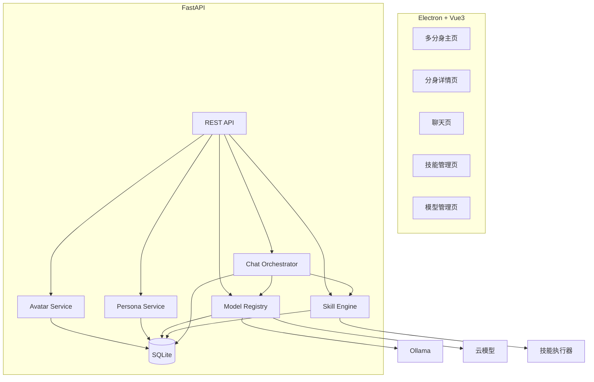
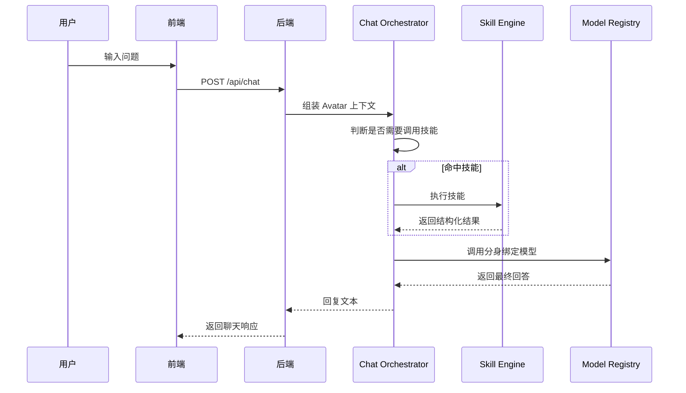

# 📋 MultiYou 第三阶段设计文档 — 多分身与能力扩展版

> **阶段目标**：将单分身产品扩展为可管理多个分身的系统，同时引入多模型配置与技能系统基础版。  
> **交付物**：支持多分身管理、分身绑定不同模型、技能注册与绑定、基础技能调用的桌面应用版本。

---

## 一、阶段定位

第三阶段开始从“一个像素分身”升级为“多个分身共同存在的系统”。

重点解决三类问题：

- 一个用户如何管理多个分身
- 不同分身如何绑定不同模型与人格
- 分身如何具备基础的外部能力调用

### 核心成果

| 能力 | 说明 | 优先级 |
|:---|:---|:---:|
| 多分身管理 | 创建、查看、编辑、删除多个分身 | P0 |
| 多模型绑定 | 分身可绑定不同模型配置 | P0 |
| 技能系统基础版 | 技能注册、绑定、调用 | P0 |
| 人格模板复用 | 人格模板可重复使用 | P1 |
| 分身详情页 | 查看分身完整配置 | P1 |
| 聊天编排 | 对话时按分身配置组装上下文 | P0 |

### 本阶段边界

**本阶段只包含：**

- 多分身管理
- 多模型配置与切换
- 技能系统基础版
- 聊天编排

**本阶段不包含：**

- 动画渲染与状态机
- 桌面悬浮陪伴
- 云同步、技能市场、多 Agent 协作

---

## 二、核心公式

第三阶段正式落地核心定义：

**分身 = Persona + Model + Skills**

这意味着分身不再只是“头像 + 聊天对象”，而是一个带有能力配置的实体。

---

## 三、架构升级

### 新增关键模块

- **Model Registry**：统一管理本地与云端模型
- **Skill Engine**：管理技能注册、绑定、调用
- **Chat Orchestrator**：组装上下文、决定是否触发技能

### 架构图



---

## 四、数据模型升级

```sql
CREATE TABLE skill (
    id INTEGER PRIMARY KEY AUTOINCREMENT,
    name TEXT NOT NULL UNIQUE,
    description TEXT,
    endpoint TEXT,
    schema_json TEXT,
    enabled INTEGER DEFAULT 1,
    created_at DATETIME DEFAULT CURRENT_TIMESTAMP
);

CREATE TABLE avatar_skill (
    id INTEGER PRIMARY KEY AUTOINCREMENT,
    avatar_id INTEGER NOT NULL,
    skill_id INTEGER NOT NULL,
    priority INTEGER DEFAULT 0,
    created_at DATETIME DEFAULT CURRENT_TIMESTAMP,
    FOREIGN KEY (avatar_id) REFERENCES avatar(id),
    FOREIGN KEY (skill_id) REFERENCES skill(id)
);
```

### 设计重点

- 一个用户可以拥有多个 avatar
- 每个 avatar 绑定一个 model
- 每个 avatar 可以绑定多个 skill
- persona 模板可以被多个 avatar 复用

---

## 五、技能系统设计

### 目标

让分身可以在基础文本回复之外，调用外部能力处理任务。

### Skill 元数据示例

```json
{
  "name": "Summarize",
  "description": "对文本进行摘要",
  "endpoint": "/skills/summarize",
  "schema": {
    "type": "object",
    "properties": {
      "text": { "type": "string" }
    },
    "required": ["text"]
  }
}
```

### 技能调用策略

1. Chat Orchestrator 根据规则判断是否命中技能
2. 命中后调用 Skill Engine
3. Skill Engine 执行技能并返回结构化结果
4. Skill 结果注入模型上下文
5. 模型生成最终自然语言回复

### 首批建议技能

| 技能 | 用途 |
|:---|:---|
| Summarize | 文本摘要 |
| WebSearch | 搜索结果摘要 |
| CodeGen | 代码生成 |
| FileRead | 本地文本读取 |

---

## 六、多模型接入设计

### 目标

不同分身可以绑定不同模型，实现人格与模型差异化。

### 抽象接口

```python
class BaseModelProvider:
    async def chat(self, model_name: str, messages: list, config: dict) -> str:
        raise NotImplementedError
```

### Provider 范围

- OllamaProvider
- OpenAIProvider
- DeepSeekProvider

### 统一入口

```python
class ModelRegistry:
    async def chat(self, model_record, messages):
        pass
```

---

## 七、聊天编排设计

### 对话流程



---

## 八、前端页面升级

### 页面范围

| 页面 | 说明 |
|:---|:---|
| 主页 | 多分身列表、搜索、创建 |
| 分身详情页 | 人格、模型、技能展示 |
| 模型管理页 | 模型新增、编辑、测试 |
| 技能管理页 | 技能列表、绑定、解绑 |
| 人格管理页 | 模板创建与复用 |

### 体验原则

- 配置能力集中到详情页和管理页
- 聊天页只做聊天，不承载复杂配置
- 多分身切换要轻量清晰

---

## 九、后端 API 扩展

### 模型接口

| 方法 | 路径 | 说明 |
|:---|:---|:---|
| GET | `/api/models` | 获取模型列表 |
| POST | `/api/models` | 新增模型 |
| PUT | `/api/models/{id}` | 修改模型 |
| DELETE | `/api/models/{id}` | 删除模型 |

### 技能接口

| 方法 | 路径 | 说明 |
|:---|:---|:---|
| GET | `/api/skills` | 获取技能列表 |
| POST | `/api/skills` | 注册技能 |
| POST | `/api/avatars/{id}/skills` | 绑定技能 |
| DELETE | `/api/avatars/{id}/skills/{skillId}` | 解绑技能 |

### 分身接口

| 方法 | 路径 | 说明 |
|:---|:---|:---|
| PUT | `/api/avatars/{id}` | 更新分身 |
| DELETE | `/api/avatars/{id}` | 删除分身 |

---

## 十、安全边界

- 技能执行必须经过统一 Skill Engine
- Skill 输入需要 schema 校验
- 文件读取技能必须限制根目录白名单
- 高风险命令类技能不在本阶段开放
- 云模型 API Key 继续使用独立安全存储

---

## 十一、开发任务拆解

| # | 任务 | 模块 | 依赖 |
|:---:|:---|:---:|:---:|
| 1 | 设计多分身数据结构与页面模型 | 全栈 | 阶段二 |
| 2 | 扩展 Avatar CRUD 支持多分身 | 后端 | 1 |
| 3 | 实现 Model Registry | 后端 | 阶段一 |
| 4 | 实现模型管理 API | 后端 | 3 |
| 5 | 设计并实现 Skill 表与绑定表 | 后端 | 1 |
| 6 | 实现 Skill Engine | 后端 | 5 |
| 7 | 实现 Chat Orchestrator | 后端 | 3, 6 |
| 8 | 前端新增分身详情、模型管理、技能管理页面 | 前端 | 2, 4, 6 |
| 9 | 完成多分身聊天联调 | 全栈 | 7, 8 |

---

## 十二、验收标准

- [ ] 一个用户可以创建多个分身
- [ ] 每个分身可以绑定不同人格和模型
- [ ] 可以在 UI 中查看并管理技能绑定关系
- [ ] 用户发起请求时，系统可按规则触发技能
- [ ] 技能结果可以注入模型生成更完整答案
- [ ] 本地模型与云端模型都可被正常调用
