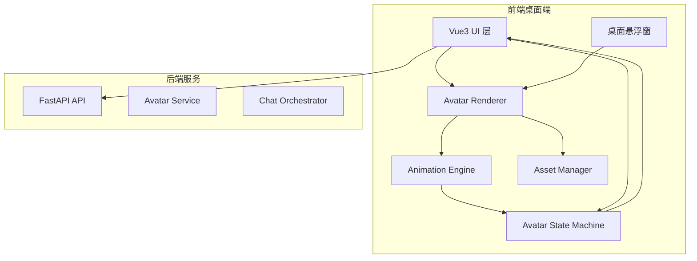
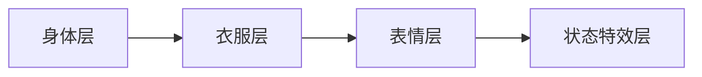
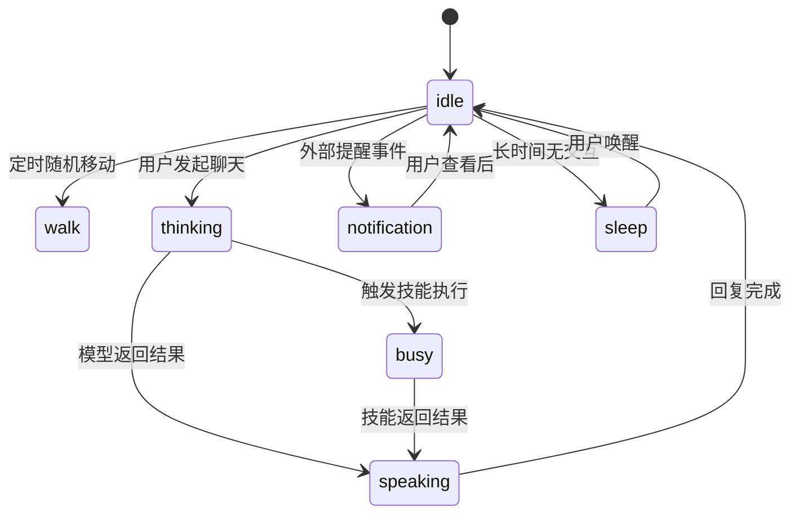
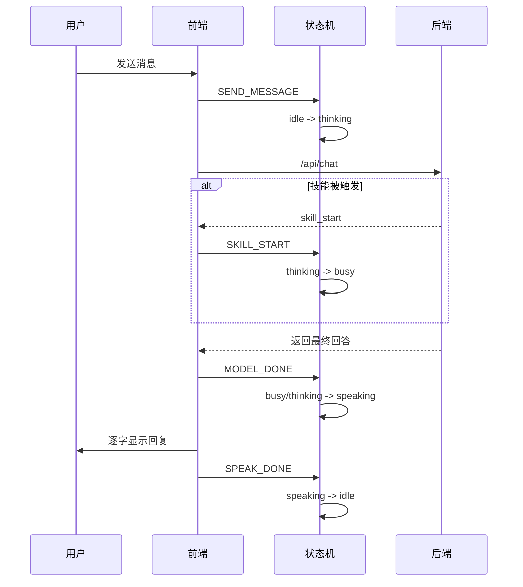
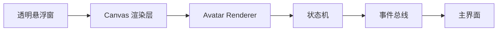

# 📋 MultiYou 第三阶段设计文档 — 增强版

> **阶段目标**：在多分身可用的基础上，增强产品的“生命感”和“桌面陪伴感”，实现桌面动画、状态系统、互动反馈与整体 UI/UX 提升。  
> **交付物**：具备像素分身动态表现、状态切换、桌面悬浮展示和更成熟交互体验的增强版桌面应用。

---

## 一、阶段概述

第三阶段不再只是补功能，而是开始塑造 MultiYou 的产品体验差异化。前两阶段解决的是“能不能用”，第三阶段解决的是“是否有灵魂、是否让人愿意长期使用”。

本阶段聚焦四个方向：

- **桌面可视化**：让分身从静态头像变成可动的像素角色
- **状态系统**：赋予分身待机、行走、思考、回复等状态表现
- **交互反馈**：让用户感知分身正在工作，而非仅仅显示一段文本
- **UI/UX 提升**：让桌面端更像一款完整产品，而不是管理后台

### 核心功能清单

| 功能 | 说明 | 优先级 |
|:---|:---|:---:|
| 分身动态渲染 | 像素角色在桌面或应用内动态展示 | P0 |
| 状态机系统 | 待机、行走、思考、回复、忙碌等状态 | P0 |
| Canvas 动画引擎 | 统一驱动帧动画与位置更新 | P0 |
| 桌面悬浮模式 | 小窗显示分身，支持固定桌面角落 | P1 |
| 聊天状态可视化 | 打字中、思考中、技能执行中 | P1 |
| UI 视觉升级 | 优化布局、卡片、聊天和主题风格 | P1 |
| 资源管理机制 | 管理精灵图、状态贴图、动画帧 | P1 |

### 本阶段边界（避免跨阶段混入）

**本阶段只包含：**
- 分身动画渲染
- 状态机与交互反馈
- 桌面悬浮窗体验
- 前端 UI/UX 质量提升

**本阶段不包含：**
- 云端同步与账号跨端一致性
- 技能市场发布与安装生态
- 多 Agent 协作任务编排
- 平台级服务拆分与治理体系

---

## 二、设计目标

### 产品目标

- 强化“这不是一个普通聊天机器人，而是你的数字分身”
- 提升桌面端停留时长和陪伴感
- 通过动效和状态让 AI 行为更可理解

### 工程目标

- 将视觉表现从业务逻辑中解耦
- 建立可扩展的角色状态机
- 统一管理角色资源、状态和事件

---

## 三、整体架构升级

第三阶段新增三类前端核心模块：

- **Avatar Renderer**：负责角色渲染
- **Animation Engine**：负责帧驱动、坐标更新、节奏控制
- **State Machine**：负责角色行为状态切换

### 架构图



---

## 四、分身视觉系统设计

### 分身表现结构

第三阶段不再只使用单张头像，而是引入分层资源结构：

```
Avatar Visual = Face + Body + Clothes + Emotion + Animation State
```

### 资源目录建议

```
assets/
└── avatar/
    ├── body/
    │   ├── idle/
    │   ├── walk/
    │   └── think/
    ├── face/
    │   ├── neutral/
    │   ├── happy/
    │   ├── thinking/
    │   └── busy/
    ├── clothes/
    │   ├── student/
    │   ├── worker/
    │   └── coder/
    └── metadata/
        └── atlas.json
```

### 分层渲染顺序



### 说明

- 身体决定基础动作姿态
- 衣服表示角色身份差异
- 脸部表情反映当前情绪/状态
- 特效层用于表现思考、消息提示、技能执行等反馈

---

## 五、动画系统设计

### 动画驱动原理

使用 Canvas + requestAnimationFrame 实现前端动画渲染。动画循环负责：

1. 更新状态机
2. 计算角色位置
3. 切换动画帧
4. 渲染当前图层

### 动画主循环

```javascript
function loop(timestamp) {
  updateState(timestamp)
  updatePosition(timestamp)
  updateAnimationFrame(timestamp)
  renderAvatar()
  requestAnimationFrame(loop)
}
```

### 动画帧定义

```ts
interface AnimationClip {
  name: string
  frames: string[]
  fps: number
  loop: boolean
}
```

### 示例动画资源

| 动画 | 说明 | 帧数 | fps |
|:---|:---|:---:|:---:|
| idle | 待机轻微呼吸 | 4 | 4 |
| walk | 行走 | 6 | 8 |
| think | 思考动作 | 4 | 5 |
| speak | 回复时嘴部变化或轻微跳动 | 3 | 6 |
| busy | 技能执行中 | 4 | 6 |

### 位置更新策略

本阶段采用二维平面内的简单角色移动逻辑：

```javascript
avatar.x += avatar.velocityX
avatar.y += avatar.velocityY
```

可用于：
- 悬浮窗内短距离走动
- 聊天期间轻微位移
- 状态变化时的小范围动态反馈

---

## 六、状态机系统设计

### 状态目标

通过有限状态机（FSM）让分身在不同交互阶段表现不同姿态与反馈。

### 状态列表

| 状态 | 说明 | 触发条件 |
|:---|:---|:---|
| idle | 待机 | 用户无操作 |
| walk | 行走 | 悬浮模式自由移动 |
| thinking | 思考中 | 模型正在生成答案 |
| speaking | 回复中 | 分身消息逐字显示 |
| busy | 执行技能中 | 技能调用中 |
| notification | 有新消息/提醒 | 定时任务或事件触发 |
| sleep | 长时间无交互 | 超时进入低活跃状态 |

### 状态切换图



### 状态机接口

```ts
interface AvatarStateMachine {
  currentState: string
  transition(event: string): void
  update(deltaTime: number): void
}
```

### 事件示例

| 事件 | 来源 |
|:---|:---|
| SEND_MESSAGE | 用户发送消息 |
| MODEL_START | 后端开始推理 |
| MODEL_DONE | 模型返回结果 |
| SKILL_START | 技能调用开始 |
| SKILL_DONE | 技能执行结束 |
| USER_IDLE_TIMEOUT | 用户长时间无操作 |
| REMINDER_TRIGGERED | 提醒任务触发 |

---

## 七、聊天可视化增强

### 目标

提升用户对分身工作过程的理解，让“等待模型回复”的过程具有视觉反馈，而不是纯空白等待。

### 表现方式

- **thinking**：头顶气泡或小图标，如 `...`
- **busy**：状态标签显示“正在执行技能”
- **speaking**：聊天消息逐字出现，配合轻微动作
- **notification**：角色头顶弹出红点/提示框

### 对话流程增强图



---

## 八、桌面悬浮窗设计

### 场景目标

让分身在聊天窗口之外也能存在，成为“常驻桌面伙伴”。

### 悬浮模式能力

| 能力 | 说明 |
|:---|:---|
| 固定显示 | 常驻桌面角落 |
| 拖拽移动 | 用户可调整位置 |
| 点击唤起主界面 | 点击角色打开聊天或详情 |
| 提示消息气泡 | 新消息/提醒时展示气泡 |
| 自动穿透模式 | 可选不阻碍正常桌面操作 |

### Electron 实现要点

- 使用透明窗口渲染角色
- 去除窗口边框，开启 always-on-top
- 支持拖拽位置记忆
- 根据系统 DPI 调整像素渲染比例

### 悬浮窗结构



---

## 九、前端 UI/UX 升级

### 设计方向

本阶段需要让界面从“功能页”升级为“产品界面”，重点优化：

- 视觉层级清晰
- 卡片与聊天界面更具人格感
- 分身相关元素更突出
- 降低配置感，增强陪伴感

### 重点优化区域

| 区域 | 优化点 |
|:---|:---|
| 首页 | 分身卡片更具角色感，加入状态徽标 |
| 聊天页 | 左侧角色区更醒目，展示动态分身 |
| 分身详情页 | 强化人格、技能、模型展示分组 |
| 主题系统 | 引入统一色板、字体、像素风元素 |
| 空状态页 | 提升视觉氛围，减少空白感 |

### 首页卡片升级示意

```
┌──────────────────────────┐
│ [动态像素分身]     ● 在线 │
│ 名称：程序分身             │
│ 人格：理性 / 精准          │
│ 模型：deepseek-coder       │
│ 技能：CodeGen / FileRead   │
│ [进入聊天]  [查看详情]     │
└──────────────────────────┘
```

### 聊天页布局升级

```
┌────────────────────────────────────────────┐
│ 返回      程序分身               设置       │
├────────────────────────────────────────────┤
│ [左侧动态角色区]   [右侧聊天区]            │
│  状态：Thinking     用户消息               │
│  表情：思考中       分身回复               │
│  技能：CodeGen      技能调用提示           │
├────────────────────────────────────────────┤
│ 输入框                              [发送] │
└────────────────────────────────────────────┘
```

---

## 十、资源管理与性能设计

### 资源管理目标

动画与状态资源增多后，需要统一管理，避免前端散乱加载。

### Asset Manager 职责

- 管理图片路径和元数据
- 懒加载动画资源
- 做缓存复用
- 管理主题/皮肤资源切换

### 元数据示例

```json
{
  "avatarType": "student",
  "animations": {
    "idle": ["idle_1.png", "idle_2.png", "idle_3.png"],
    "walk": ["walk_1.png", "walk_2.png", "walk_3.png"]
  },
  "emotions": {
    "neutral": "face_neutral.png",
    "thinking": "face_thinking.png"
  }
}
```

### 性能原则

- 动画帧率不追求过高，像素风适合低帧数动画
- 聊天页和悬浮窗共用渲染核心，避免双套逻辑
- 大量分身时只激活当前视图中的动画实例
- 非活跃窗口降低刷新频率

---

## 十一、后端联动改造

尽管本阶段重点在前端表现，但后端也要配合输出状态事件。

### 后端需要补充的事件信息

| 事件 | 说明 |
|:---|:---|
| `model_start` | 模型开始推理 |
| `skill_start` | 技能开始执行 |
| `skill_done` | 技能执行结束 |
| `reply_stream` | 流式返回文本 |
| `reply_done` | 回复完成 |

### 返回格式建议

```json
{
  "session_id": 42,
  "events": [
    { "type": "model_start", "timestamp": 171000001 },
    { "type": "skill_start", "skill": "CodeGen" },
    { "type": "skill_done", "skill": "CodeGen" },
    { "type": "reply_done" }
  ],
  "reply": "这是最终生成的代码示例..."
}
```

### 流式输出建议

若条件允许，本阶段可引入 SSE 或 WebSocket，让前端逐步显示回复，并联动 speaking 状态。

---

## 十二、开发任务拆解

| # | 任务 | 模块 | 依赖 |
|:---:|:---|:---:|:---:|
| 1 | 设计分身动画资源规范与目录结构 | 前端 | 阶段二 |
| 2 | 实现 Asset Manager | 前端 | 1 |
| 3 | 实现 Avatar Renderer | 前端 | 1, 2 |
| 4 | 实现 Animation Engine | 前端 | 3 |
| 5 | 实现 Avatar State Machine | 前端 | 3 |
| 6 | 聊天页接入状态可视化 | 前端 | 5 |
| 7 | 实现桌面悬浮窗模式 | Electron | 3, 5 |
| 8 | 升级首页、详情页、聊天页 UI | 前端 | 3 |
| 9 | 后端增加事件状态输出 | 后端 | 阶段二 |
| 10 | 增加动画与悬浮模式测试 | 全栈 | all |

---

## 十三、验收标准

- [ ] 分身可以在应用中以动态像素角色形式展示
- [ ] 分身具备至少 idle、thinking、speaking 三种状态
- [ ] 聊天过程中状态切换与后端执行链路一致
- [ ] 悬浮窗模式可正常显示、拖拽和打开主界面
- [ ] UI 比第二阶段明显更完整、更有产品感
- [ ] 动画资源管理清晰，可支持后续继续扩展
