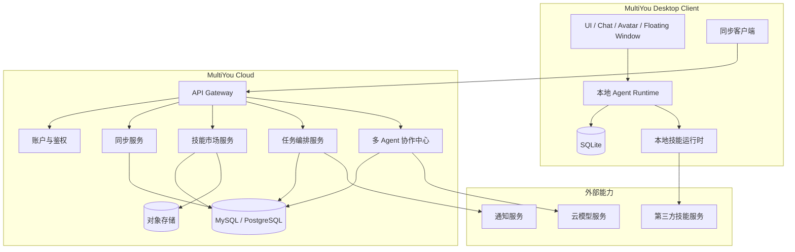
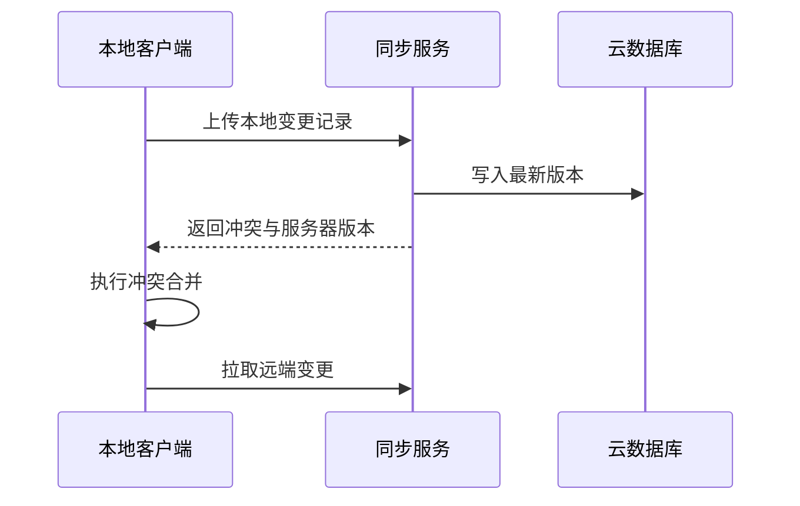
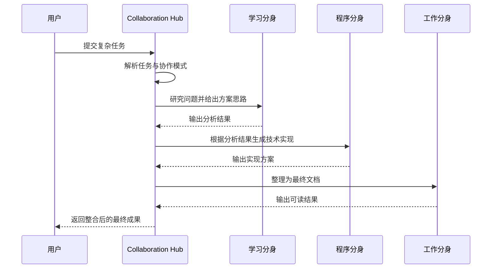

# 📋 MultiYou 第四阶段设计文档 — 扩展版

> **阶段目标**：将 MultiYou 从单机桌面分身系统演进为具备云端同步、技能生态和多 Agent 协作能力的平台化产品。  
> **交付物**：支持跨端数据同步、技能市场、任务编排与多分身协同执行的扩展版系统设计。

---

## 一、阶段概述

第四阶段是平台化阶段。前三个阶段已经完成了：

- 基础闭环：上传照片、生成分身、对话
- 系统扩展：多分身、多模型、多技能
- 产品体验：动画、状态、桌面陪伴

第四阶段开始解决更长远的问题：

- 如何让分身不局限在单机本地
- 如何让能力通过市场机制持续扩展
- 如何让多个分身协同完成复杂任务
- 如何让 MultiYou 从“应用”成长为“平台”

### 核心能力清单

| 功能 | 说明 | 优先级 |
|:---|:---|:---:|
| 云端同步 | 用户分身、人格、模型配置、会话摘要同步 | P0 |
| 技能市场 | 浏览、安装、升级、启用第三方技能 | P0 |
| 多 Agent 协作 | 多个分身围绕同一任务协作 | P0 |
| 任务调度系统 | 定时提醒、日程、自动执行流程 | P1 |
| 工作流编排 | 将技能与分身能力串联为任务流 | P1 |
| 多端访问 | 为未来 Web / Mobile 同步留接口 | P2 |
| 权限与沙箱升级 | 第三方技能与协作任务的安全边界控制 | P0 |

### 本阶段边界（避免与前阶段重复）

**本阶段只包含：**
- 云端同步能力
- 技能市场与技能生态机制
- 多 Agent 协作与工作流编排
- 平台级安全治理与服务边界设计

**本阶段不重复建设：**
- 基础注册登录与单分身闭环（第一阶段）
- 多分身/多模型/基础技能绑定（第二阶段）
- 动画状态机与悬浮窗体验（第三阶段）

---

## 二、平台化架构设计

### 架构目标

第四阶段需要从“本地单体架构”升级为“本地客户端 + 云端服务 + 扩展生态”的混合架构。

### 分层架构图



---

## 三、云端同步设计

### 同步目标

在保证本地优先的基础上，为用户提供可选的云端同步能力，实现：

- 分身配置跨设备同步
- 人格与模型配置同步
- 技能绑定关系同步
- 会话摘要同步，而非默认同步全部敏感对话内容

### 同步策略

采用 **本地优先 + 用户可控上云** 的策略：

- 默认本地存储
- 用户可显式开启云同步
- 细粒度选择同步内容
- 敏感聊天默认仅同步摘要，不同步全文

### 同步数据范围

| 数据类型 | 默认同步策略 |
|:---|:---|
| 用户资料 | 同步 |
| 分身基础配置 | 同步 |
| 人格模板 | 同步 |
| 模型配置 | 同步，敏感信息加密 |
| 技能绑定关系 | 同步 |
| 会话摘要 | 同步 |
| 完整聊天记录 | 默认不同步，用户可开启 |
| 原始用户照片 | 不同步 |

### 同步架构流程



### 冲突处理策略

| 数据对象 | 冲突策略 |
|:---|:---|
| 分身昵称 | 最新修改覆盖 |
| 人格 Prompt | 保留冲突版本供用户选择 |
| 模型配置 | 以版本号为准 |
| 技能绑定关系 | 合并去重 |
| 聊天摘要 | 追加合并 |

---

## 四、技能市场设计

### 目标

从“系统内置技能”升级为“可安装、可升级、可分发的技能生态”。

### 核心能力

- 技能浏览
- 技能详情页
- 技能安装/卸载
- 技能版本管理
- 技能评分和使用说明
- 技能权限声明

### 技能包结构设计

```json
{
  "name": "WebSearch",
  "version": "1.2.0",
  "author": "MultiYou Community",
  "description": "联网搜索并提取摘要",
  "entry": "index.py",
  "permissions": ["network"],
  "schema": {
    "type": "object",
    "properties": {
      "query": { "type": "string" }
    }
  },
  "runtime": "python",
  "signature": "base64-signature"
}
```

### 技能市场流程


### 技能分类建议

| 类别 | 说明 |
|:---|:---|
| 生产力 | 文档处理、总结、翻译 |
| 开发 | 代码生成、文件分析、调试辅助 |
| 数据 | CSV/XLSX 分析、图表生成 |
| 联网 | 搜索、抓取、资讯摘要 |
| 自动化 | 日程、提醒、文件归档 |
| 社交陪伴 | 情绪陪伴、消息建议 |

### 技能权限模型

| 权限 | 说明 |
|:---|:---|
| `network` | 可访问外部网络 |
| `filesystem:read` | 可读取本地文件 |
| `filesystem:write` | 可写入本地文件 |
| `notification` | 可触发系统通知 |
| `clipboard` | 可读取剪贴板 |
| `shell` | 可执行命令，默认禁用高危 |

---

## 五、多 Agent 协作设计

### 目标

这是 MultiYou 的关键差异化能力之一。多个分身不再只是并列存在，而是可以围绕一个目标协同工作。

### 协作模型

示例：

- 学习分身：负责知识理解与提炼
- 程序分身：负责代码实现
- 工作分身：负责整理成文档输出

三者围绕“完成一个技术方案”协同执行。

### 协作角色抽象

```ts
interface CollaborationAgent {
  avatarId: number
  role: string
  responsibility: string
  modelId: number
  skills: string[]
}
```

### 协作任务结构

```json
{
  "task": "为项目生成架构设计方案",
  "agents": [
    { "avatar_id": 1, "role": "researcher" },
    { "avatar_id": 2, "role": "engineer" },
    { "avatar_id": 3, "role": "writer" }
  ],
  "mode": "sequential"
}
```

### 协作模式

| 模式 | 说明 |
|:---|:---|
| sequential | 顺序执行，上一个分身输出给下一个 |
| parallel | 并行执行，再聚合结果 |
| planner-executor | 一个分身负责规划，其余负责执行 |
| debate | 多分身针对同一问题提出观点，再综合 |

### 协作流程图



### 协作中心职责

- 任务拆解
- 分身选择与角色分配
- 上下文路由
- 结果聚合
- 冲突消解
- 成本与时长控制

---

## 六、任务调度与工作流系统

### 目标

让分身不仅被动响应，还能主动执行周期性任务与复杂任务链。

### 调度能力

| 能力 | 示例 |
|:---|:---|
| 定时提醒 | 每天早上 9 点提醒开会 |
| 周报生成 | 每周五整理本周工作记录 |
| 自动摘要 | 定时整理文档夹内容 |
| 定时研究任务 | 每晚抓取关注主题资讯 |

### 工作流定义示例

```json
{
  "name": "每周技术周报",
  "trigger": { "type": "cron", "expr": "0 18 * * FRI" },
  "steps": [
    { "type": "skill", "name": "WebSearch" },
    { "type": "agent", "avatar_id": 1 },
    { "type": "agent", "avatar_id": 3 }
  ]
}
```

### 工作流执行图


---

## 七、安全与治理升级

第四阶段必须显著提升系统治理能力，因为这时将引入：

- 云端同步
- 第三方技能
- 多 Agent 自动协作
- 更高权限执行能力

### 安全治理重点

| 风险 | 说明 | 防护措施 |
|:---|:---|:---|
| 第三方技能恶意行为 | 读取敏感文件、执行恶意操作 | 权限声明 + 沙箱隔离 + 签名验证 |
| 云端数据泄露 | 同步数据可能包含隐私 | 端到端加密 + 可选同步 |
| 多 Agent 越权行动 | 分身自动调用技能产生风险 | 审批机制 + 人在回路 |
| 高危命令执行 | shell/文件修改可能带来破坏 | 默认禁用，按技能白名单放行 |

### 人在回路机制

高风险动作必须确认，例如：

- 写入本地文件
- 删除文件
- 执行系统命令
- 上传数据到外部服务

### 技能审计日志

所有技能调用与协作任务都记录审计日志：

```json
{
  "timestamp": "2026-03-26T10:00:00Z",
  "avatar_id": 2,
  "skill": "FileWrite",
  "action": "write_file",
  "target": "notes/today.md",
  "approved": true
}
```

---

## 八、后端服务拆分建议

第四阶段建议将后端逐步拆为多个逻辑服务，但不要求一开始完全微服务化。

### 推荐服务边界

| 服务 | 职责 |
|:---|:---|
| Auth Service | 用户、鉴权、令牌 |
| Sync Service | 云同步、版本合并 |
| Skill Market Service | 技能发布、安装、评分、版本 |
| Workflow Service | 工作流定义与执行 |
| Collaboration Hub | 多 Agent 协作编排 |
| Notification Service | 通知、提醒、系统消息 |

### 原则

- 先逻辑拆分，再按需要物理拆分
- 保持客户端协议稳定
- 优先保证本地版本可独立运行

---

## 九、前端产品形态扩展

### 新页面

| 页面 | 说明 |
|:---|:---|
| 云同步设置页 | 管理同步开关、同步范围 |
| 技能市场页 | 浏览和安装技能 |
| 协作任务页 | 发起多分身协作任务 |
| 工作流页 | 查看和配置自动任务 |
| 审批中心 | 审批高风险操作 |

### 协作任务页示意

```
┌──────────────────────────────────────────────┐
│ 新建协作任务                                  │
├──────────────────────────────────────────────┤
│ 任务目标：为新功能生成设计方案                │
│ 参与分身：学习分身 / 程序分身 / 工作分身      │
│ 协作模式：顺序执行                            │
│ [开始任务]                                    │
├──────────────────────────────────────────────┤
│ 任务进度：                                    │
│ 1. 学习分身分析中...                          │
│ 2. 程序分身等待执行                           │
│ 3. 工作分身等待执行                           │
└──────────────────────────────────────────────┘
```

### 技能市场页示意

```
┌──────────────────────────────────────────────┐
│ 技能市场      搜索框              已安装(12)  │
├──────────────────────────────────────────────┤
│ [WebSearch]   联网搜索与摘要      [安装]      │
│ [CodeGen]     代码生成助手        [已安装]    │
│ [CSV Analyst] 表格分析工具        [安装]      │
└──────────────────────────────────────────────┘
```

---

## 十、开发任务拆解

| # | 任务 | 模块 | 依赖 |
|:---:|:---|:---:|:---:|
| 1 | 设计云同步数据模型与同步协议 | 后端/客户端 | 阶段三 |
| 2 | 实现 Sync Client 与 Sync Service | 全栈 | 1 |
| 3 | 设计技能包规范与签名机制 | 平台 | 阶段二 |
| 4 | 实现技能市场服务与前端市场页 | 全栈 | 3 |
| 5 | 实现技能安装、更新、卸载流程 | 全栈 | 4 |
| 6 | 设计 Collaboration Hub 协议与任务模型 | 后端 | 阶段二 |
| 7 | 实现多 Agent 协作执行链路 | 后端 | 6 |
| 8 | 实现协作任务页与执行监控 UI | 前端 | 7 |
| 9 | 实现 Workflow Engine 与调度任务 | 后端 | 7 |
| 10 | 实现审批中心与高风险动作确认机制 | 全栈 | 5, 7, 9 |
| 11 | 增加审计日志与权限治理系统 | 全栈 | all |
| 12 | 进行压力测试、安全测试与发布方案验证 | 全栈 | all |

---

## 十一、验收标准

- [ ] 用户可选择开启云端同步，并同步分身基础配置
- [ ] 技能市场可浏览、安装、卸载技能
- [ ] 技能安装时展示权限说明，并进行校验
- [ ] 用户可发起一个多分身协作任务，并查看执行过程
- [ ] 协作任务支持至少一种稳定协作模式（顺序或并行）
- [ ] 高风险技能或动作需要用户确认后才能执行
- [ ] 系统保留完整审计日志，支持排查技能行为
- [ ] 本地模式仍然可独立运行，不依赖云端服务
