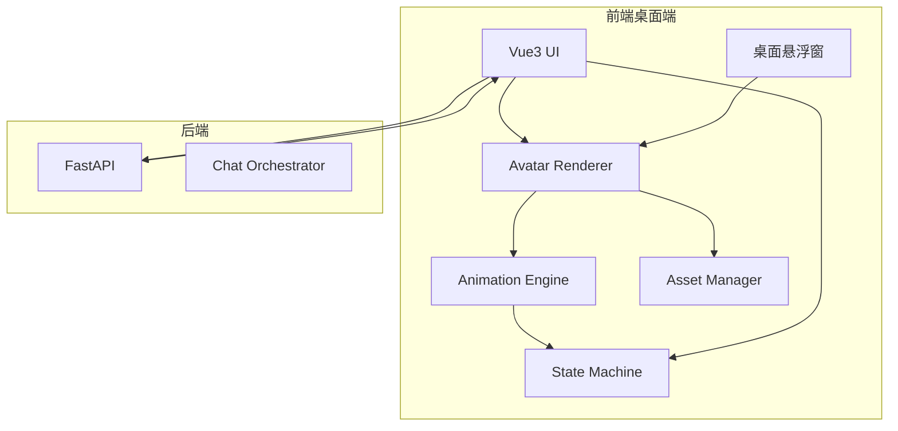
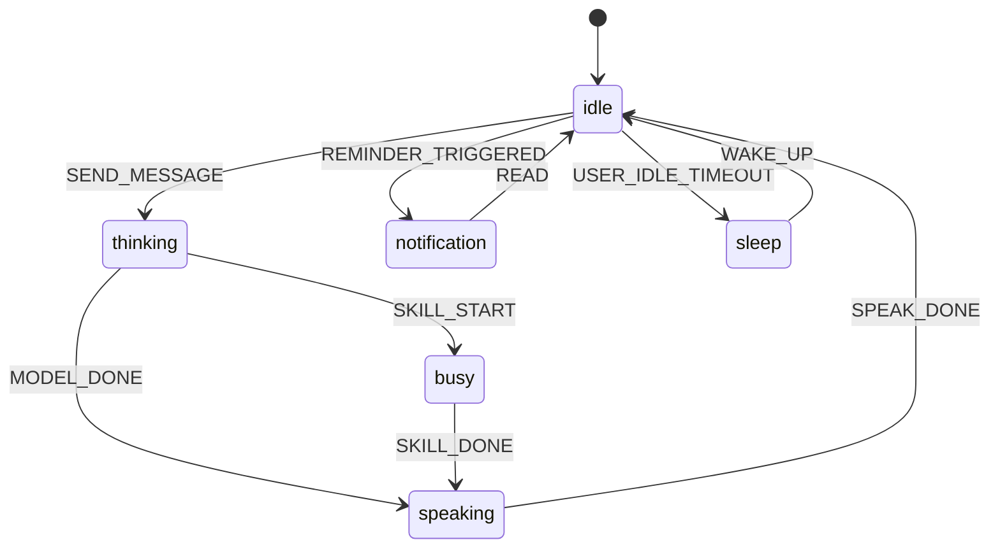

# 📋 MultiYou 第四阶段设计文档 — 生命感与桌面陪伴版

> **阶段目标**：在多分身系统可用的基础上，增强产品的“生命感”和“陪伴感”，实现动画状态、桌面悬浮、状态反馈与 UI 体验升级。  
> **交付物**：具备动态像素分身、状态机、桌面悬浮展示和更成熟界面风格的增强版桌面应用。

---

## 一、阶段定位

第四阶段不再扩展能力边界，而是重点塑造产品体验。

前几个阶段解决的是：

- 能不能运行
- 能不能生成分身
- 能不能扩展多分身与技能

第四阶段解决的是：

- 分身有没有“活着”的感觉
- 用户能不能感知分身正在思考、执行、回应
- 桌面端体验是否足够有辨识度

### 核心成果

| 能力 | 说明 | 优先级 |
|:---|:---|:---:|
| 动态像素渲染 | 像素角色可在应用中动态展示 | P0 |
| 状态机系统 | idle / thinking / speaking / busy 等状态 | P0 |
| 桌面悬浮窗 | 分身可常驻桌面 | P1 |
| 聊天过程可视化 | 思考中、技能执行中、回复中的视觉反馈 | P1 |
| UI/UX 升级 | 首页、聊天页、详情页整体升级 | P1 |

### 本阶段边界

**本阶段只包含：**

- 动画与渲染系统
- 状态机与事件联动
- 桌面悬浮模式
- UI 与体验升级

**本阶段不包含：**

- 云同步
- 技能市场
- 多 Agent 协作
- 平台级服务拆分

---

## 二、体验目标

### 产品目标

- 强化“这不是普通聊天框，而是一个桌面分身”
- 提升用户对分身行为的感知
- 形成陪伴感和产品差异化

### 工程目标

- 视觉层与业务逻辑解耦
- 渲染、状态机、事件流有清晰分层
- 聊天页和悬浮窗共享同一套表现核心

---

## 三、前端架构升级

### 新增模块

- **Avatar Renderer**：角色渲染
- **Animation Engine**：帧驱动与位置更新
- **State Machine**：状态切换管理
- **Asset Manager**：动画资源与图层资源管理

### 架构图



---

## 四、视觉系统设计

### 分身表现公式

**Avatar Visual = Body + Clothes + Face + Emotion + State Effect**

### 资源结构建议

```text
assets/
└── avatar/
    ├── body/
    ├── face/
    ├── clothes/
    ├── effects/
    └── metadata/
```

### 分层渲染顺序


---

## 五、动画系统设计

### 动画循环

```javascript
function loop(timestamp) {
  updateState(timestamp)
  updatePosition(timestamp)
  updateFrame(timestamp)
  renderAvatar()
  requestAnimationFrame(loop)
}
```

### 动画类型

| 动画 | 说明 |
|:---|:---|
| idle | 待机 |
| walk | 行走 |
| think | 思考 |
| speak | 回复 |
| busy | 技能执行 |

### 性能原则

- 像素风不追求高帧率
- 只激活当前可见分身实例
- 非活跃窗口降低刷新频率

---

## 六、状态机系统设计

### 状态列表

| 状态 | 说明 | 触发条件 |
|:---|:---|:---|
| idle | 待机 | 无交互 |
| thinking | 思考中 | 模型推理中 |
| busy | 执行技能中 | 技能触发 |
| speaking | 回复中 | 文本输出中 |
| notification | 提醒/消息提示 | 事件触发 |
| sleep | 长时间无交互 | 超时 |

### 状态切换图



---

## 七、聊天过程可视化

### 表现目标

让用户知道分身“正在做什么”，不是只有静态文本结果。

### 可视化内容

- `thinking`：头顶气泡或点点动画
- `busy`：显示技能执行标签
- `speaking`：逐字显示回复文本
- `notification`：桌面提醒气泡

### 后端事件配合

| 事件 | 说明 |
|:---|:---|
| `model_start` | 模型开始推理 |
| `skill_start` | 技能开始执行 |
| `skill_done` | 技能完成 |
| `reply_stream` | 流式文本返回 |
| `reply_done` | 回复结束 |

---

## 八、桌面悬浮窗设计

### 场景目标

让分身在主应用之外也可以存在，成为长期驻留的桌面伙伴。

### 预期能力

| 能力 | 说明 |
|:---|:---|
| 固定显示 | 常驻桌面角落 |
| 拖拽移动 | 用户调整位置 |
| 点击唤起 | 打开主界面或聊天 |
| 消息气泡 | 新消息/提醒时提示 |
| 可选穿透 | 不影响桌面操作 |

### Electron 实现要求

- 透明窗口
- 无边框
- always-on-top
- 位置持久化

---

## 九、UI/UX 升级方向

### 重点优化区域

| 区域 | 方向 |
|:---|:---|
| 首页 | 更强的角色感和状态感 |
| 聊天页 | 左侧动态分身区 + 右侧聊天区 |
| 分身详情页 | 更清晰的人格/模型/技能分组 |
| 主题系统 | 像素风元素、统一配色、统一字体策略 |

### 设计原则

- 减少“管理后台感”
- 增强“产品界面感”
- 强化分身而非表单配置的视觉中心地位

---

## 十、开发任务拆解

| # | 任务 | 模块 | 依赖 |
|:---:|:---|:---:|:---:|
| 1 | 设计分身资源规范与目录结构 | 前端 | 阶段三 |
| 2 | 实现 Asset Manager | 前端 | 1 |
| 3 | 实现 Avatar Renderer | 前端 | 1, 2 |
| 4 | 实现 Animation Engine | 前端 | 3 |
| 5 | 实现 Avatar State Machine | 前端 | 3 |
| 6 | 聊天页接入状态可视化 | 前端 | 5 |
| 7 | 实现桌面悬浮窗模式 | Electron | 3, 5 |
| 8 | 升级首页、详情页、聊天页 UI | 前端 | 3 |
| 9 | 后端增加状态事件输出 | 后端 | 阶段三 |
| 10 | 完成动画与悬浮窗联调测试 | 全栈 | all |

---

## 十一、验收标准

- [ ] 分身可以动态像素角色形式展示
- [ ] 至少具备 idle、thinking、speaking 三种状态
- [ ] 聊天过程中状态切换与后端链路一致
- [ ] 桌面悬浮窗可显示、拖拽并唤起主界面
- [ ] UI 相比第三阶段明显更完整、更有产品感
