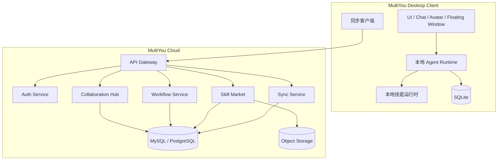
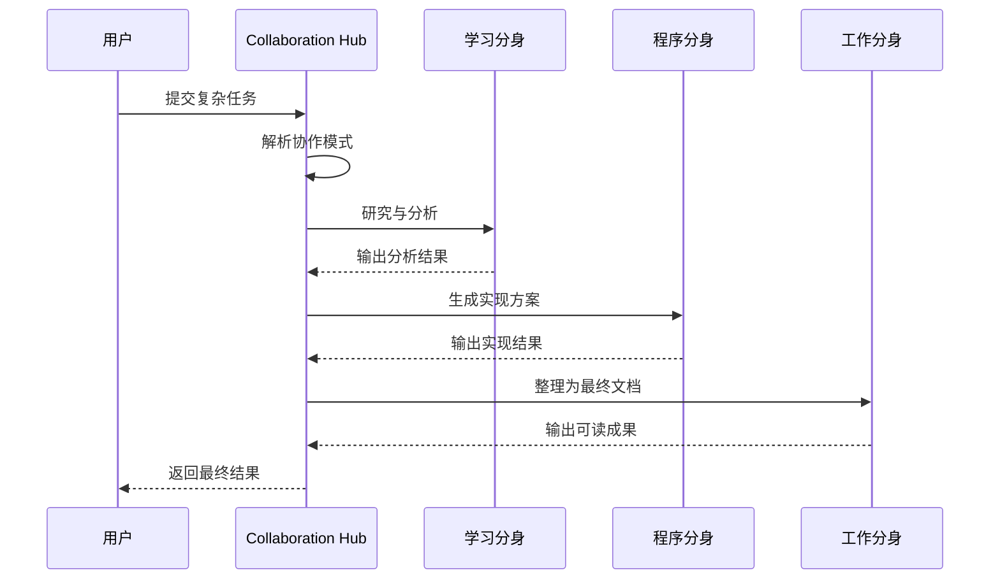

# 📋 MultiYou 第五阶段设计文档 — 平台化版

> **阶段目标**：将 MultiYou 从本地桌面分身应用演进为具备云同步、技能市场和多 Agent 协作能力的平台化产品。  
> **交付物**：支持跨设备同步、第三方技能分发安装、多分身协作任务执行的平台化系统设计。

---

## 一、阶段定位

第五阶段解决的是产品的长期扩展能力。

此前几个阶段完成了：

- 基础骨架与打包
- 像素分身生成
- 多分身、多模型、技能系统
- 动画状态与桌面陪伴体验

第五阶段进一步回答：

- 数据如何跨设备同步
- 能力如何通过市场机制扩展
- 多个分身如何协同完成复杂任务
- 系统如何从“应用”走向“平台”

### 核心成果

| 能力 | 说明 | 优先级 |
|:---|:---|:---:|
| 云同步 | 分身配置、人格、模型、技能绑定跨端同步 | P0 |
| 技能市场 | 技能浏览、安装、升级、卸载 | P0 |
| 多 Agent 协作 | 多个分身围绕同一任务协同工作 | P0 |
| 工作流编排 | 技能与分身能力可组成任务流 | P1 |
| 审批与审计 | 高风险动作审批、全链路审计日志 | P0 |

### 本阶段边界

**本阶段只包含：**

- 云端同步能力
- 技能市场与安装生态
- 多 Agent 协作与任务编排
- 平台级安全治理

**本阶段不重复建设：**

- 基础认证与打包
- 单分身像素生成
- 多分身基础管理
- 动画与桌面陪伴逻辑

---

## 二、平台化架构

### 架构目标

从“本地单体”升级为“本地客户端 + 云端服务 + 可扩展生态”。

### 架构图



---

## 三、云同步设计

### 同步原则

- 本地优先
- 用户显式开启同步
- 敏感内容默认最小同步
- 支持冲突处理与版本合并

### 默认同步内容

| 数据 | 策略 |
|:---|:---|
| 用户资料 | 同步 |
| 分身基础配置 | 同步 |
| 人格模板 | 同步 |
| 模型配置 | 同步，敏感字段加密 |
| 技能绑定关系 | 同步 |
| 会话摘要 | 同步 |
| 完整聊天记录 | 默认不同步，可选开启 |
| 原始照片 | 默认不同步 |

### 冲突策略

| 对象 | 策略 |
|:---|:---|
| 分身昵称 | 最新修改覆盖 |
| 人格 Prompt | 保留冲突版本供用户选择 |
| 模型配置 | 版本号优先 |
| 技能绑定 | 合并去重 |
| 会话摘要 | 追加合并 |

---

## 四、技能市场设计

### 目标

让技能从“系统内置”升级为“可安装、可升级、可分发”。

### 核心能力

- 浏览技能
- 查看详情
- 安装与卸载
- 升级与版本管理
- 权限声明展示
- 签名校验

### 技能包示例

```json
{
  "name": "WebSearch",
  "version": "1.2.0",
  "author": "MultiYou Community",
  "description": "联网搜索并提取摘要",
  "entry": "index.py",
  "permissions": ["network"],
  "runtime": "python",
  "signature": "base64-signature"
}
```

### 权限模型

| 权限 | 说明 |
|:---|:---|
| `network` | 外部网络访问 |
| `filesystem:read` | 本地文件读取 |
| `filesystem:write` | 本地文件写入 |
| `notification` | 系统通知 |
| `clipboard` | 读取剪贴板 |
| `shell` | 执行系统命令，高风险 |

---

## 五、多 Agent 协作设计

### 目标

多个分身围绕同一个复杂目标进行分工协作。

### 协作角色模型

```ts
interface CollaborationAgent {
  avatarId: number
  role: string
  responsibility: string
  modelId: number
  skills: string[]
}
```

### 协作模式

| 模式 | 说明 |
|:---|:---|
| sequential | 顺序执行，上一个输出给下一个 |
| parallel | 并行执行，最后聚合 |
| planner-executor | 一个分身负责规划，其余执行 |
| debate | 多分身提出观点后再综合 |

### 协作流程



---

## 六、工作流与调度系统

### 目标

让分身不仅被动响应，还能主动执行周期性任务和复杂任务流。

### 示例能力

| 能力 | 示例 |
|:---|:---|
| 定时提醒 | 每天早上 9 点提醒会议 |
| 周报生成 | 每周五整理工作记录 |
| 自动摘要 | 定时整理文档内容 |
| 研究任务 | 每晚抓取关注主题资讯 |

### 工作流示例

```json
{
  "name": "每周技术周报",
  "trigger": { "type": "cron", "expr": "0 18 * * FRI" },
  "steps": [
    { "type": "skill", "name": "WebSearch" },
    { "type": "agent", "avatar_id": 1 },
    { "type": "agent", "avatar_id": 3 }
  ]
}
```

---

## 七、安全治理升级

### 风险来源

- 第三方技能
- 云端同步
- 多 Agent 自动协作
- 更高权限的文件与命令访问

### 防护策略

| 风险 | 防护措施 |
|:---|:---|
| 第三方技能恶意行为 | 权限声明 + 沙箱隔离 + 签名验证 |
| 云端数据泄露 | 加密同步 + 用户可控范围 |
| 多 Agent 越权执行 | 审批机制 + 人在回路 |
| 高危系统命令 | 默认禁用，仅白名单开放 |

### 审批机制

以下动作必须显式确认：

- 写入本地文件
- 删除文件
- 执行系统命令
- 上传数据到外部服务

### 审计日志示例

```json
{
  "timestamp": "2026-03-26T10:00:00Z",
  "avatar_id": 2,
  "skill": "FileWrite",
  "action": "write_file",
  "target": "notes/today.md",
  "approved": true
}
```

---

## 八、前端产品形态扩展

### 新页面

| 页面 | 说明 |
|:---|:---|
| 云同步设置页 | 管理同步开关与同步范围 |
| 技能市场页 | 浏览、安装、升级技能 |
| 协作任务页 | 发起多分身协作任务 |
| 工作流页 | 配置和查看自动任务 |
| 审批中心 | 审批高风险动作 |

---

## 九、开发任务拆解

| # | 任务 | 模块 | 依赖 |
|:---:|:---|:---:|:---:|
| 1 | 设计同步协议与版本模型 | 后端/客户端 | 阶段四 |
| 2 | 实现 Sync Client 与 Sync Service | 全栈 | 1 |
| 3 | 设计技能包规范与签名机制 | 平台 | 阶段三 |
| 4 | 实现技能市场服务与市场页 | 全栈 | 3 |
| 5 | 实现技能安装、升级、卸载流程 | 全栈 | 4 |
| 6 | 设计 Collaboration Hub 协议与任务模型 | 后端 | 阶段三 |
| 7 | 实现多 Agent 协作执行链路 | 后端 | 6 |
| 8 | 实现协作任务页与执行监控 UI | 前端 | 7 |
| 9 | 实现 Workflow Engine 与调度能力 | 后端 | 7 |
| 10 | 实现审批中心与高风险确认机制 | 全栈 | 5, 7, 9 |
| 11 | 增加审计日志与治理系统 | 全栈 | all |

---

## 十、验收标准

- [ ] 用户可选择开启云同步，并同步分身基础配置
- [ ] 技能市场可浏览、安装、卸载技能
- [ ] 技能安装时展示权限说明并进行校验
- [ ] 用户可发起一个多分身协作任务，并查看执行过程
- [ ] 协作任务支持至少一种稳定模式
- [ ] 高风险技能或动作需要用户确认后才能执行
- [ ] 系统保留完整审计日志用于排查行为
- [ ] 本地模式仍可独立运行，不依赖云端服务