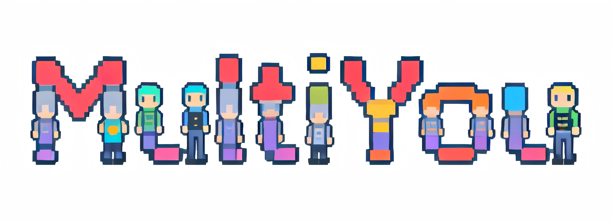

<div align="center">



### 让多个世界的你，为现在的你工作

*Empowering your parallel selves to work for you.*

<br/>

[](../../)
[](LICENSE)
[](../../)
[](../../pulls)

</div>

---

## 🌌 这是什么？

想象一下 —— 如果平行世界里**专注学习的你**、**擅长写作的你**、**精通数据的你**，都能同时在你的电脑上为你工作，会怎样？

**MultiYou** 让这件事成为现实。

你只需上传一张照片，MultiYou 会将你变成一个个像素风格的「数字分身」。每一个分身拥有独立的性格、专属技能，以及对应的 AI 大脑，可以同时帮你处理不同任务。

> 💡 **一句话理解**：MultiYou 就像是你的「AI 分身团队」，每个成员都长得像你，但各有所长。

---

## 🪄 它能做什么？

### 🖼️ 生成你的专属像素分身
上传一张照片，系统自动生成独具个性的像素风格数字人形象，并为其取名、设定性格与专长。

### 🧠 为每个分身配置专属 AI
不同的分身可以搭配不同的 AI 模型——有的擅长逻辑分析，有的擅长创意写作，有的专注代码开发。

### 🛠️ 自由搭配技能模块
像搭积木一样，为每个分身装配不同的「技能」，比如联网搜索、文件处理、代码执行等，灵活组合，按需扩展。

<br/>

> 📐 **分身公式：**
>
> **分身 = 人格（Persona） + AI 模型（Model） + 技能集合（Skills）**

---

## 🎭 能用来做什么？

| 分身类型 | 帮你做的事 |
|:---:|:---|
| 📚 **学习分身** | 帮你总结知识、整理笔记、解答疑惑 |
| 💼 **工作分身** | 起草文档、处理邮件、协助项目推进 |
| 💻 **程序分身** | 生成代码、查找错误、优化逻辑 |
| 📊 **数据分身** | 读取数据、自动分析、生成报告 |
| 💬 **社交分身** | 日常闲聊、情绪陪伴、随时倾听 |

---

## 🌠 设计理念

在每一个平行世界里，你做出了不同的选择，成就了截然不同的自己。

MultiYou 将这些「可能的你」带入现实，让它们协同工作，打破单一身份的局限。

<br/>

<div align="center">

### 你不再是一个人在孤军奋战，
### 而是一支由「你自己」组成的团队。

</div>

---

## 🗺️ 开发进度

| 功能模块 | 状态 |
|:---|:---:|
| 像素分身生成（基础版） | 🔲 计划中 |
| 分身管理系统 | 🔲 计划中 |
| 多 AI 模型接入 | 🔲 计划中 |
| 技能系统设计与实现 | 🔲 计划中 |
| 分身对话能力 | 🔲 计划中 |
| 桌面悬浮助手（宠物形态） | 🔲 计划中 |
| 多分身协作 | 🔲 计划中 |

---

## 🔧 技术说明（写给开发者）

<details>
<summary>点击展开技术栈详情</summary>

<br/>

| 层级 | 使用技术 |
|:---|:---|
| 界面 | Vue 3 + Pinia + Vue Router + vue-cropper |
| 桌面端打包 | Electron + electron-builder（Windows NSIS） |
| 后端服务 | FastAPI + SQLAlchemy（同步）+ uvicorn |
| AI 接入 | DeepSeek（默认）/ Ollama（本地）/ 任意 OpenAI 兼容 API |
| 数据库 | SQLite |
| 图像处理 | Pillow（像素化流水线：512→32→128 NEAREST） |
| 认证 | JWT（python-jose）+ bcrypt（passlib）|
| API Key 存储 | keyring（系统凭据管理器）|
| HTTP 客户端 | httpx（后端调用 LLM）/ axios（前端） |
| 状态持久化 | pinia-plugin-persistedstate |

**整体架构：**

```
Electron
├── BackendManager（spawn FastAPI 子进程，健康轮询）
└── BrowserWindow（加载 Vue 前端）

Vue 3 前端
├── stores/auth      — 登录态 & JWT
├── stores/avatar    — 分身 / 会话 / 聊天记录
└── stores/onboarding — 引导向导跨步骤数据

FastAPI 后端
├── /api/auth        — 注册 / 登录
├── /api/models      — 模型配置 CRUD + 连接测试
├── /api/avatars     — 分身 & 角色管理
├── /api/sessions    — 会话管理
├── /api/chat        — 对话（OpenAICompatProvider）
└── /api/onboarding  — 一步完成引导设置

用户
├── 像素分身（Avatar）
├── AI 模型（Model）
├── 人格设定（Persona）
└── 会话记录（Session / ChatLog）
```

</details>

---

## 🌍 English

**MultiYou** is an AI desktop assistant that turns your photo into pixel-style digital avatars — each with its own personality, AI model, and skill set, ready to work for you in parallel.

Think of it as building a team of AI agents, all shaped like *you*.

---

## 🤝 参与贡献

无论你是有想法想分享、发现了问题想反馈，还是想直接贡献代码，都非常欢迎！

- 💡 **有想法？** 提一个 [Issue](../../issues)
- 🐛 **发现 Bug？** 也欢迎提 [Issue](../../issues)
- 🛠️ **想参与开发？** 提交 [Pull Request](../../pulls) 即可

<br/>

<div align="center">

如果这个项目让你感到有趣或受到启发，欢迎点击右上角 ⭐ 支持一下！

**你的每一颗星，都是对「另一个世界的你」最好的鼓励。**

</div>