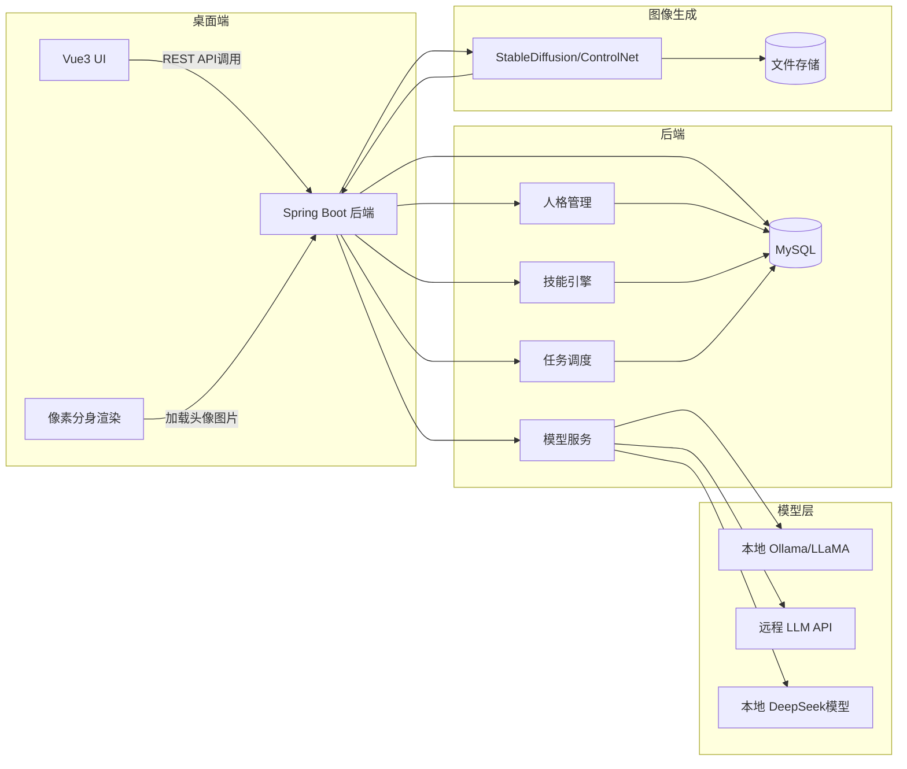
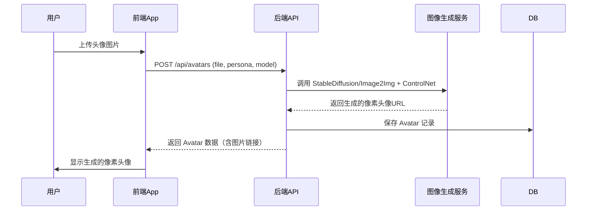
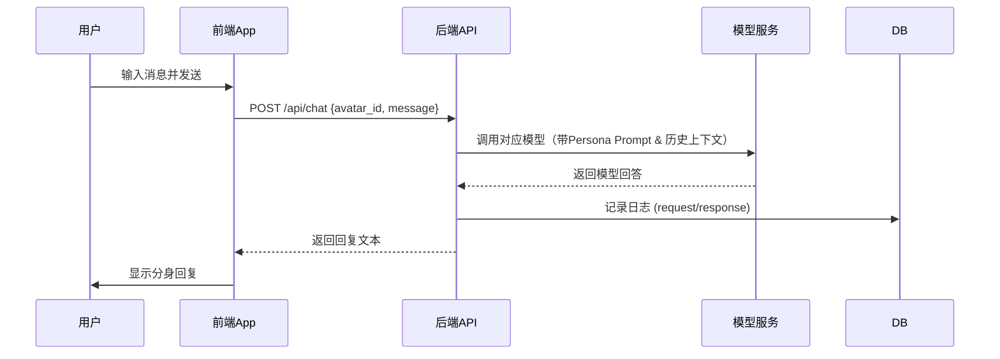
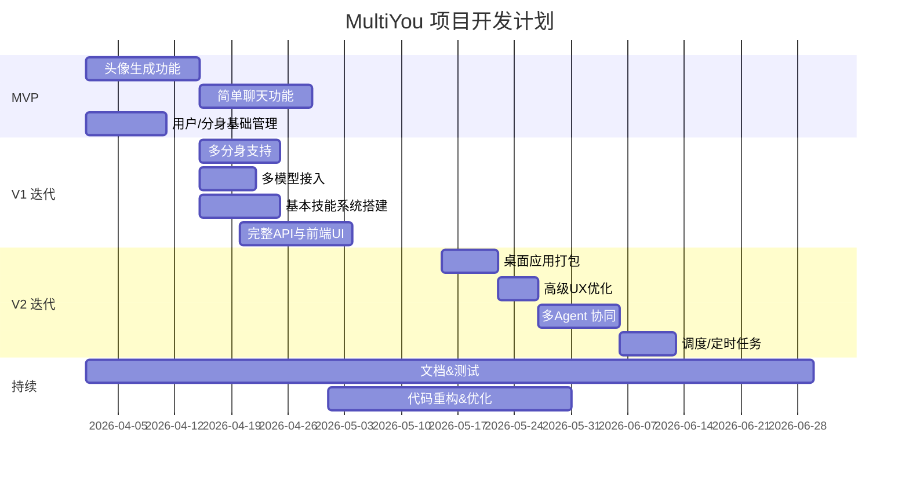

# 摘要

**MultiYou** 是一个开源的桌面 AI 多智能体系统，核心理念是“人格化 AI + 可视化分身”。用户上传照片生成像素风数字人形象，并为每个分身绑定独立的人格设定、AI 模型和可复用的技能（Skill）。每个数字人代表平行世界中的你，通过智能代理协助完成学习、工作、生活任务。相比于现有 AI 助手项目，MultiYou 创新地将**Avatar (数字分身)**、**Persona (人格系统)**、**Agent (智能体执行)**、**Skills (能力扩展)**和**桌面可视化**结合在一起，填补了市场空白【16†L20-L27】【19†L68-L76】。本报告分析竞品生态，给出系统架构图、数据库模型、API 设计、前端流程、图像生成及模型集成方案，并涵盖安全、里程碑、CI/CD 等实施细节，帮助开发团队快速启动 MultiYou 项目。

## 1. 竞争生态与参考项目

目前 GitHub 上已有不少开源AI助手/多智能体项目，但都各有侧重：

- **Accomplish**（MIT 协议） – 开源桌面代理工具，本地运行、文件管理、文档生成、浏览器自动化等工作流【16†L20-L27】；支持 OpenAI、Claude 等云 API，也可通过 Ollama 调用本地模型，强调数据安全【16†L20-L27】。是直接对标的参照之一。
- **Bytebot** – 容器化桌面 AI 代理框架，采用四层架构（桌面容器、AI 服务、Web UI、存储），提供虚拟桌面环境和动作控制【17†L18-L20】【17†L46-L54】。特点是通过 Docker 容器隔离任务，支持多种 LLM 和工具，对企业自动化友好【17†L18-L20】【17†L88-L96】。
- **OctopusAIAgent（章鱼哥）** – 多任务本地化桌面助手，特点是**可视化 Sub-Agent**（类似多角色），支持 Markdown 编写技能扩展、内置 Python 环境、USB 便携运行、实时 Token 统计等（CSDN 社区有报道）。强调本地存储和可拓展的技能【8†L59-L67】【8†L115-L124】。
- **Eigent**（基于 CAMEL 框架） – 多智能体“劳动力”概念，将复杂任务拆解为多个并行执行的Agent，如开发、浏览器、文档、多模态等【19†L68-L76】。支持 vLLM、Ollama、LM Studio 等本地模型，提供**人在回路**机制保证安全【19†L100-L104】。适合长链路的自动化工作流。
- **AionUI** – 面向 CLI 工具（如 Claude）、基于 Electron 的跨平台 GUI 聚合器，支持多种文件格式预览和远程控制【19†L83-L92】。免费替代昂贵商业版，重点在 UI 可视化和无缝操作，不是多 Agent 协作核心。
- **AIRI** – 开源多模态数字桌面伴侣，基于 LLM，可交互聊天、游戏、虚拟环境互动，跨平台支持 Web、macOS、Windows【3†L1932-L1940】；突出虚拟角色形象和多样交互。【3†L1952-L1960】提供网站和开源仓库，可参考其多模态技术。
- **UI-TARS Desktop**（ByteDance） – 多模态 GUI 代理框架，允许通过本地或远程控制“计算机操作”“浏览器操作”【24†L25-L34】；提供强大的模型和视觉代理能力，但更偏向企业级自动化。
- 其他：开源个人助手**Personal AI (PersonAI)**、**Personal-ai-pai**（多平台集成微信/Telegram 等）、**Sim**（AI Agent 工作流可视化构建工具）等。

**竞争分析小结：** 多数项目关注“AI 执行”、自动化工作流和**桌面操作能力**【17†L18-L20】【19†L68-L76】。少数项目强调**角色形象**或**人格系统**（如 AIRI、Open LLM VTuber）。目前尚无开源项目能同时将**数字人 Avatar**、**多人格/多角色 Agent**、**技能系统**、**桌面互动**集于一体。MultiYou 的差异化在于：**“用户自己”化身为多 Agent，具备视觉化分身与个性化人格**，填补市场空白【16†L20-L27】【19†L68-L76】。

## 2. 系统架构（高层图）

MultiYou 采用前后端分离、模块化架构。主要组件包括：

- **前端桌面端**：Electron（或轻量级 Tauri）+ Vue3 实现跨平台桌面App；负责 UI 渲染、交互、与后端 API 通信、Canvas 像素角色展示等。
- **Avatar Renderer**：前端组件，接收服务端生成的像素头像，绘制并支持简单动画（如走动、表情变化）。
- **图像生成服务**：调用 Stable Diffusion/Image-to-Image + ControlNet / IP-Adapter，将用户照片生成像素化头像；可作为后端模块或独立微服务。
- **后端 API**：Spring Boot 提供 RESTful 接口；包含认证、分身管理、任务调度等功能。
- **模型层**：本地 Ollama 及远程 LLM API（OpenAI、DeepSeek、Anthropic等）的接口层；根据配置调用相应模型完成对话或工具调用。
- **技能引擎**：提供插件式 Skill 执行环境，调度各类技能（如文本总结、代码生成、Web搜索、系统自动化）。
- **人格管理器**：存储并应用每个分身的人格设定（System Prompt、语气等）。
- **存储与数据库**：MySQL 存储用户、分身、对话记录等数据。
- **认证 & 调度**：OAuth/JWT 认证模块；计划任务调度器（Quartz 等）执行定时任务。

下面用 Mermaid 图示组件交互（图例省略）：



**组件职责说明：**  
- 桌面端 (Electron/Tauri + Vue3)：实现桌面应用部署，可用系统托盘、悬浮窗等形式。Vue3 处理视图逻辑，Canvas/WebGL 绘制像素分身形象，列表分身、聊天窗口、技能面板等 UI。  
- AvatarRenderer：前端渲染模块，可使用 PixiJS/WebGL 动画像素角色。  
- 后端 (Spring Boot)：提供用户/分身管理、认证授权、任务调度、日志持久化等。采用 MyBatis-Plus 访问 MySQL。  
- AI 模型层：Ollama 本地服务（兼容 OpenAI API）运行 LLM 模型；同时支持云端服务如 OpenAI/Gemini 等。  
- 技能引擎：按需加载技能插件，每个技能可单独部署并通过 REST/MCP 调用；统一管理技能的输入输出。  
- 调度器：Quartz/Cron 定时执行已配置任务，例如定时提醒或周报总结。  

## 3. 数据模型设计

设计如下核心表结构（MySQL）：

```sql
CREATE TABLE User (
  id BIGINT AUTO_INCREMENT PRIMARY KEY,
  username VARCHAR(50) NOT NULL UNIQUE,
  password_hash VARCHAR(255) NOT NULL,
  email VARCHAR(100) UNIQUE,
  created_at DATETIME DEFAULT CURRENT_TIMESTAMP,
  updated_at DATETIME DEFAULT CURRENT_TIMESTAMP ON UPDATE CURRENT_TIMESTAMP
);

CREATE TABLE Persona (
  id BIGINT AUTO_INCREMENT PRIMARY KEY,
  user_id BIGINT NOT NULL,
  name VARCHAR(100) NOT NULL,
  system_prompt TEXT NOT NULL,
  style VARCHAR(50),  -- 可视化风格：赛博/可爱等
  description TEXT,
  created_at DATETIME DEFAULT CURRENT_TIMESTAMP,
  FOREIGN KEY (user_id) REFERENCES User(id)
);

CREATE TABLE Model (
  id BIGINT AUTO_INCREMENT PRIMARY KEY,
  name VARCHAR(100) NOT NULL,  -- 如“gpt-3.5-turbo”、“qwen-7b”
  provider VARCHAR(50) NOT NULL,  -- 如 OpenAI, Ollama
  endpoint TEXT,  -- API 地址或本地模型名称
  config JSON,   -- 模型参数（temperature等）
  created_at DATETIME DEFAULT CURRENT_TIMESTAMP
);

CREATE TABLE Skill (
  id BIGINT AUTO_INCREMENT PRIMARY KEY,
  name VARCHAR(100) NOT NULL,  -- 技能名
  description TEXT,            -- 技能简介
  config JSON,   -- 可配置参数（超时等）
  created_at DATETIME DEFAULT CURRENT_TIMESTAMP
);

CREATE TABLE Avatar (
  id BIGINT AUTO_INCREMENT PRIMARY KEY,
  user_id BIGINT NOT NULL,
  persona_id BIGINT NOT NULL,
  model_id BIGINT NOT NULL,
  name VARCHAR(100),    -- 分身昵称
  image_url VARCHAR(255), -- 头像图像路径
  created_at DATETIME DEFAULT CURRENT_TIMESTAMP,
  FOREIGN KEY (user_id) REFERENCES User(id),
  FOREIGN KEY (persona_id) REFERENCES Persona(id),
  FOREIGN KEY (model_id) REFERENCES Model(id)
);

CREATE TABLE Session (
  id BIGINT AUTO_INCREMENT PRIMARY KEY,
  avatar_id BIGINT NOT NULL,
  start_time DATETIME DEFAULT CURRENT_TIMESTAMP,
  end_time DATETIME,
  FOREIGN KEY (avatar_id) REFERENCES Avatar(id)
);

CREATE TABLE Logs (
  id BIGINT AUTO_INCREMENT PRIMARY KEY,
  session_id BIGINT NOT NULL,
  role ENUM('user','assistant','system') NOT NULL,
  content TEXT,
  timestamp DATETIME DEFAULT CURRENT_TIMESTAMP,
  FOREIGN KEY (session_id) REFERENCES Session(id)
);
```

- **User**：用户信息，支持用户名、邮箱注册。  
- **Persona**：人格模板，每个用户可自定义多个人格（system prompt、风格描述）。  
- **Model**：已接入的 LLM 模型配置，可支持本地或云端。  
- **Skill**：技能插件信息，包含名称、描述和参数设定。  
- **Avatar**：数字分身记录，关联用户、人格和模型，存储头像 URL。一个 Avatar 实质上是一个“专属 Agent”。  
- **Session**：会话记录，每次与分身的连续对话对应一条会话。  
- **Logs**：对话历史，存储用户和分身的每条交流内容，用于上下文和记忆。

## 4. 后端 API 设计

采用 REST 风格，使用 JWT Token 认证。主要接口示例：

- **POST /api/auth/register** – 用户注册  
  - 请求：`{ "username": "...", "password": "...", "email": "..." }`  
  - 响应：`{ "userId": 1, "token": "..." }`  

- **POST /api/auth/login** – 用户登录  
  - 请求：`{ "username": "...", "password": "..." }`  
  - 响应：`{ "userId": 1, "token": "..." }`  

- **GET /api/avatars** – 列出当前用户所有分身  
  - 响应：`[{ "id":1, "name":"学习分身", "image_url":"...", ...}, ...]`  

- **POST /api/avatars** – 创建新的分身  
  - 请求（multipart/form-data）：包含 `file`（头像图片）、`name`、`persona_id`、`model_id`。  
  - 响应：`{ "id":2, "image_url":"...", "name":"娱乐分身" }`  

- **GET /api/avatars/{id}** – 获取指定分身详情  
- **PUT /api/avatars/{id}** – 更新分身（可修改昵称或绑定技能等）  

- **POST /api/personas** – 创建人格模板  
  - 请求：`{ "name":"学习分身","system_prompt":"你是一名耐心的学习助手","style":"可爱" }`  
  - 响应：`{ "id":5, "name":"学习分身" }`  

- **GET /api/personas** – 列出所有人格  
- **PUT/DELETE /api/personas/{id}` – 修改/删除人格  

- **GET /api/models** – 列出可用模型  
- **POST /api/models** – 添加远程模型或本地模型配置  

- **GET /api/skills** – 列出系统技能  
- **POST /api/avatars/{id}/skills** – 为分身绑定技能  
  - 请求：`{ "skill_id": 3 }`  
  - 响应：`{ "avatarId":1, "skills":[ ... ] }`  

- **POST /api/chat** – 与分身对话（Agent 模型推理）  
  - 请求：`{ "avatar_id":1, "message":"帮我总结一下这段文字" }`  
  - 响应：`{ "reply":"这是分身的回答...", "sessionId":123 }`  
  - 后端会将此请求送入对应模型（Ollama/OpenAI），并记录上下文与日志。

- **GET /api/sessions/{id}/logs** – 查询会话历史（对话记录）  

> **认证说明：** 所有用户数据接口均需在请求头附带 `Authorization: Bearer <token>`。

## 5. 前端 UX 流程与原型

### 关键界面
1. **登录/注册页面**：输入用户名密码，切换注册或登录。  
2. **主界面**：分身列表（卡片式，每个显示头像、昵称、状态），顶部或侧边导航。  
3. **创建分身页面**：上传照片预览→选风格（赛博、可爱、像素美术等）→选择人格模板→选择模型→生成并查看像素化头像。  
4. **分身详情/聊天页面**：左侧显示分身像素角色（可简单动效或表情变化），右侧聊天窗显示对话。顶部/侧边有“技能”按钮打开技能列表，“设置”编辑分身名称/头像。  
5. **人格/模型/技能管理**：可以在设置中管理自定义人格、添加本地模型或API、选择技能库。

### 主要交互流程
- **分身生成流程（序列图示）**：



- **对话交互流程**：



### UI 原型示例
（此处可结合实际设计工具插入示意图，或使用 ASCII/mermaid 绘制简单布局。）  
**首页**：分身卡片 + 创建按钮 + 侧边栏导航。  
**聊天页面**：左侧固定角色头像/动画，右侧为聊天气泡墙，底部输入框。  
**设置面板**：包含分身名称、选择人格、切换模型、添加技能按钮等。

## 6. 图像生成流程

生成像素头像的关键在于**保持用户面部特征一致**的同时，实现像素风格。可采用以下方法：

- **Stable Diffusion 图生图**：输入用户照片 + 文本提示（如“像素艺术风格头像”），使用较低的 denoising 强度（如 0.3-0.5）让输出与输入图像相似。  
- **ControlNet**：检测人脸姿势或骨骼结构，控制生成图像的姿态和比例，以确保新图与原始图片保持一致的位置/角度。  
- **IP-Adapter**【31†L9-L12】：腾讯AILab 的 IP-Adapter 可将输入图像作为“风格”提示，轻量化地引入图像信息，从而更好地保持服装/背景一致性，可用于强化像素风格一致性。  
- **Face Preservation**：可固定随机种子或使用同一 LoRA/Embedding 控制相似度；也可以先用人脸检测抠图，仅将背景替换为像素背景等简化任务。  
- **像素风格提示**：在文本提示中明确描述“8-bit 像素头像”、“赛博像素风格”等关键词。也可在后处理阶段对生成结果进行像素化处理（例如降低分辨率再放大）以增强像素感。  

**一致性策略**：多次生成时可复用 Seed，或对同一人脸训练专属 LoRA，使不同角度保持相似。亦可通过对比度低质量输入+高噪音辅助（embedding 回归）等技术增强面部一致性。但考虑本项目定位，可先采用固定 seed + 轻度 ControlNet 的方式【30†L1-L4】【31†L9-L12】。

## 7. 模型接入策略

MultiYou 支持**本地部署模型**（Ollama 兼容 Llama/Vicuna/DeepSeek 等）和**云端 API**（OpenAI、Anthropic、Google Gemini 等）。  

- **本地模型（Ollama）**：如 DeepSeek、Qwen、Llama 系列模型部署在 Ollama，本地优先，数据不出设备，有隐私优势【33†L68-L70】【19†L100-L104】。Ollama 提供 OpenAI 兼容 API 接口，前端无需改动可直接调用本地服务【33†L68-L70】。成本低、不依赖网络，但需要计算资源。  
- **远程模型**：接入商业模型可通过 API Key，无需本地资源。适用于对话需求量不大或优先质量的场景。但需平衡调用成本和隐私。【33†L68-L70】详细对比了 Ollama 与远程部署的优缺点（可引用概念）。  
- **模型选择**：在设置界面列出可用模型（本地 vs 云端），用户可为不同分身选择不同模型。表格对比示例：

| 类别     | 本地(Ollama)                                      | 云端API(OpenAI/etc)              |
|----------|--------------------------------------------------|---------------------------------|
| 优势     | 数据本地，快速响应（LAN），无API费用              | 模型质量高、参数优化齐全，多语言 |
| 劣势     | 需算力（GPU/CPU），模型文件体积大                 | 成本高，网络依赖，隐私泄露风险   |
| 示例     | DeepSeek-7B, Qwen-7B (使用 Ollama 部署)           | gpt-3.5-turbo, Claude-2         |

- **Prompt 设计**：每个 Persona 包含系统提示（system_prompt），前端调用模型时将其作为上下文的第一部分。后续可注入用户自定义参数（如`<persona>`）。例如：
  ```
  System Prompt (学习分身): "你是一名耐心细致的学习助手，擅长将专业知识通俗化..."
  Chat Prompt: "用户: 解释深度学习基础知识"
  ```
  在调用模型时，后端可组合 `[System Prompt] + 历史对话 + 用户问题` 发送给 LLM。  
- **本地和远程混合**：可为关键/敏感会话使用本地模型（如深度学习笔记），非敏感任务调用云端大模型以加速或获得更高质量回答。后端根据 `avatar.model_id` 决定调用路径。

## 8. Skills 系统设计

MultiYou 的 **Skills** 是可插拔的扩展模块，用于增强分身功能。设计要点：

- **插件接口**：每个 Skill 可视为独立服务（microservice）或脚本，具备名称、描述、输入输出接口。例如定义 JSON/YAML 配置：
  ```json
  {
    "name": "SummarizeText",
    "description": "Summarize input text.",
    "endpoint": "/skills/summarize", 
    "schema": { "text": "string" }
  }
  ```
- **技能调用**：后端统一暴露 `/skills/{skillName}` 接口，前端或模型可以通过 HTTP 请求调用。Skill 实现可以是自托管的微服务（Python/Node），接收到请求后返回结果。  
- **生命周期**：Skill 注册时加载(注册到 SkillEngine)，销毁时卸载。运行时需注意隔离和安全，可以在 Docker 容器或受限沙箱中执行，避免执行系统命令带来风险。  
- **沙箱执行**：对于执行代码（如 OS 自动化），可通过 `execvp` 等在受控环境运行，或者使用脚本语言（Python/Rust）在容器中执行，并限制网络/文件访问。  
- **示例技能**：  
  - 文本摘要（Summarize）：接收文章段落，返回简要总结。  
  - 代码生成（CodeGen）：接收需求描述，调用代码生成模型，返回示例代码。  
  - Web 搜索（WebSearch）：调用网络搜索 API（如 Bing/Azure），抓取结果摘要。  
  - 系统自动化（AutoActions）：对接 `robotjs` 或自动化库，实现打开应用、文件管理等操作（基于 Electron Node）。  
- **多技能组合**：一个分身可绑定多个技能。聊天过程中，当用户请求某功能（如“帮我写一段脚本”），Persona 的 system prompt 可引导分身调用对应 Skill。例如系统提示包含：“**当用户提到代码时**，使用 CodeGen 技能生成答案。”后端检测到用户意图（或显式命令）后路由到相应 `/api/skill/...`。  
- **管理界面**：前端提供技能市场或列表，用户可启用/禁用技能，以及为分身自定义技能排序/优先级。

## 9. 安全、隐私与数据治理

- **本地优先**：尽量支持本地部署的模型与图像生成功能，确保用户数据（输入内容、生成图片）不上传云端【33†L68-L70】【19†L100-L104】。对于敏感数据，用户可在设置中选择“仅本地模式”，关闭网络访问。  
- **隐私保护**：用户上传的照片仅用于头像生成，生成后及时删除原图，存储仅保存像素化结果。对话日志默认本地加密存储，只有用户才能访问（不泄露给任何第三方）。  
- **数据收集最小化**：除非明确征得用户同意，不收集任何额外个人信息。Chat 内容和用户偏好仅用于提供服务，不用于训练或其它用途。  
- **访问控制**：采用 JWT 认证，每个请求校验 Token，防止未授权访问或 CSRF 攻击。接口加入权限控制，例如只有头像上传接口允许文件提交，避免任意文件写入漏洞。  
- **模型安全**：可以预先对模型输出进行审查（如调用 OpenAI 的 content filter 或本地实现），禁止输出恶意/敏感内容。可参考**宪法式AI (Constitutional AI)** 审计思想，对回答做二次检查。  
- **依赖安全**：使用成熟库进行图像处理和自动化，如 Stable Diffusion / ControlNet，避免直接执行用户输入的命令。Skill 插件必须经过签名审查，权限严格隔离。  
- **法规合规**：若推向生产环境，应遵循当地隐私法律（如 GDPR），提供数据删除接口，让用户随时清除自己的数据。  

总之，通过本地部署策略【33†L68-L70】【19†L100-L104】、最小化数据收集与严格权限设计，保障用户数据与隐私安全。

## 10. 开发路线 & 里程碑

分阶段迭代、多次发布，初期聚焦关键功能，逐步扩展。下面给出一个示例开发甘特图（Mermaid）：



- **MVP （~1-2 个月）**：实现头像生成、单分身聊天、基本用户管理。输出：功能完整的 GitHub 仓库，Demo 视频/文档。【16†L20-L27】  
- **V1 (~2-3 个月)**：支持多分身、多模型配置；技能系统框架（可先内置少量技能）；桌面端打包发布（Electron/Tauri）；完成 CI/CD 流水线和基本单元测试。  
- **V2 后续**：进一步优化 UI/UX（动画效果、角色互动）、多 Agent 协作（比如多个分身同时对话）、日程/提醒调度系统、扩展技能市场、移动或 Web 客户端等。  

每阶段结束后发布 Release，收集反馈、修复问题、开源社区协作。 

## 11. CI/CD、测试与打包

- **持续集成 (CI)**：在 GitHub Actions 上配置流水线，每次 PR 后自动执行：代码静态检查 (ESLint/TSLint, Checkstyle)、后端单元测试 (JUnit)、前端单元测试 (Jest)。  
- **构建 & 测试**：使用 Maven/Gradle 构建 Spring Boot 后端并运行测试；前端使用 Vue CLI/Vite + Jest 进行组件测试。  
- **桌面打包**：  
  - **Electron**：使用 `electron-builder` 打包，生成 Windows/macOS/Linux 安装包；支持自动更新 (例如 GitHub Releases + Squirrel)。  
  - **Tauri**（如选用）：使用 Tauri CLI 与 Rust 构建，生成更轻量原生应用。  
- **发布流程 (CD)**：合并到 `main` 分支后，CI 自动打包并上传到 Releases，可自动推送到测试渠道。Tag 新版本时自动发布稳定版。  
- **测试策略**：重点测试图像上传处理流程、对话完整性、权限边界（未授权访问）、技能调用等。可模拟用户上传并验证生成逻辑。对于安全和隐私场景，可进行渗透测试（例如文件上传漏洞）。  
- **代码仓库**：建议采用 monorepo（前后端同仓）或多仓分离。重要文档如架构设计、数据库 ER 图、API 文档放入 README 或 Wiki 中；开源镜像托管如 Docker Hub（后端服务）。

## 12. 示例 README、配置与示例代码

- **README 示例**：可参考前面章节内容，简明描述项目定位、功能、安装使用步骤。例如：
  ```markdown
  # MultiYou
  
  MultiYou 是一个桌面 AI 分身助手，支持上传照片生成像素头像，为每个分身配置不同的AI模型和人格。
  
  ## 功能
  - 上传头像，生成像素风数字分身
  - 多分身支持，每个分身可独立对话
  - 绑定本地/云端模型 (Ollama, OpenAI 等)
  - 可扩展的技能系统 (Summarize, Search, CodeGen 等)
  
  ## 快速开始
  1. 克隆仓库：`git clone https://github.com/xxx/MultiYou.git`
  2. 启动后端服务：`./mvnw spring-boot:run`
  3. 启动桌面前端：`npm install && npm run electron:serve`
  4. 在设置中上传头像并创建分身，即可开始对话。
  ```
- **Persona JSON 示例**：
  ```json
  {
    "name": "学习分身",
    "system_prompt": "你是一名耐心细致的学习助手，擅长将复杂概念解释给学生听。",
    "style": "可爱",
    "description": "擅长总结知识和讲解概念"
  }
  ```
- **Skill JSON 示例**：
  ```json
  {
    "name": "TextSummarizer",
    "description": "将输入的文本进行摘要。",
    "endpoint": "/api/skills/summarize"
  }
  ```
- **调用示例代码**（Node.js）：
  ```js
  const fs = require('fs');
  // 调用后端生成头像
  async function createAvatar(token, imagePath, personaId, modelId) {
    const form = new FormData();
    form.append('file', fs.createReadStream(imagePath));
    form.append('persona_id', personaId);
    form.append('model_id', modelId);
    const res = await fetch('http://localhost:8080/api/avatars', {
      method: 'POST',
      headers: { 'Authorization': `Bearer ${token}` },
      body: form
    });
    const data = await res.json();
    console.log('分身创建成功:', data);
  }
  ```
- **CLI 示例**（Ollama 模型调用）：
  ```js
  // 使用本地 Ollama 模型生成回答
  const { OpenAI } = require("openai");
  const client = new OpenAI({ 
    baseURL: "http://localhost:11434/v1", apiKey: "ollama" 
  });
  const resp = await client.chat.completions.create({
    model: "deepseek-7b",
    messages: [
      { role: "system", content: "你是一名负责生成摘要的助手。" },
      { role: "user", content: "请摘要以下文本：..." }
    ]
  });
  console.log(resp.choices[0].message.content);
  ```
  
以上示例及配置可作为项目初始化模板。通过综合以上设计，MultiYou 将实现**可视化的多智能体助手**，为用户带来**“一人，多生”**的创新使用体验。祝项目开发顺利！【16†L20-L27】【19†L68-L76】